# D3 gallery

Looking for a good D3 example? Here’s a few (okay, 166…) to peruse.

## Animation

D3’s [data join](https://d3js.org/d3-selection/joining), [interpolators](https://d3js.org/d3-interpolate), and [easings](https://d3js.org/d3-ease) enable flexible [animated transitions](https://d3js.org/d3-transition) between views while preserving [object constancy](https://bost.ocks.org/mike/constancy/).

<a href="/d3/animated-treemap"><picture><source srcset="../thumbnail/d3/animated-treemap-dark.png" media="(prefers-color-scheme: dark)"></picture><q>Animated treemap</q></a>
<a href="/d3/temporal-force-directed-graph"><picture><source srcset="../thumbnail/d3/temporal-force-directed-graph-dark.png" media="(prefers-color-scheme: dark)">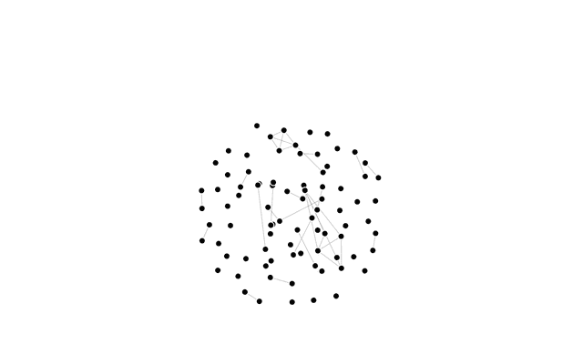</picture><q>Temporal force-directed graph</q></a>
<a href="/d3/connected-scatterplot"><picture><source srcset="../thumbnail/d3/connected-scatterplot-dark.png" media="(prefers-color-scheme: dark)">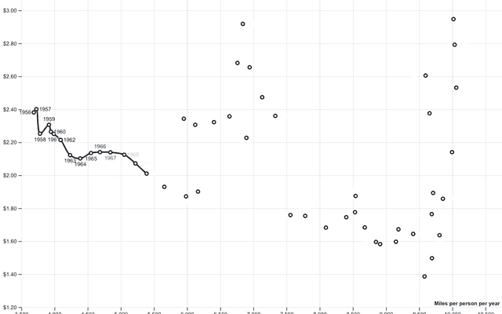</picture><q>Connected scatterplot (D3)</q></a>
<a href="/d3/the-wealth-health-of-nations"><picture><source srcset="../thumbnail/d3/the-wealth-health-of-nations-dark.png" media="(prefers-color-scheme: dark)"></picture><q>The Wealth & Health of Nations</q></a>
<a href="/d3/scatterplot-tour"><picture><source srcset="../thumbnail/d3/scatterplot-tour-dark.png" media="(prefers-color-scheme: dark)"></picture><q>Scatterplot tour</q></a>
<a href="/d3/bar-chart-race"><picture><source srcset="../thumbnail/d3/bar-chart-race-dark.png" media="(prefers-color-scheme: dark)"></picture><q>Bar chart race</q></a>
<a href="/d3/stacked-to-grouped-bars"><picture><source srcset="../thumbnail/d3/stacked-to-grouped-bars-dark.png" media="(prefers-color-scheme: dark)"></picture><q>Stacked-to-grouped bars</q></a>
<a href="/d3/streamgraph-transitions"><picture><source srcset="../thumbnail/d3/streamgraph-transitions-dark.png" media="(prefers-color-scheme: dark)"></picture><q>Streamgraph transitions</q></a>
<a href="/d3/smooth-zooming"><picture><source srcset="../thumbnail/d3/smooth-zooming-dark.png" media="(prefers-color-scheme: dark)"></picture><q>Smooth zooming</q></a>
<a href="/d3/zoom-to-bounding-box"><picture><source srcset="../thumbnail/d3/zoom-to-bounding-box-dark.png" media="(prefers-color-scheme: dark)">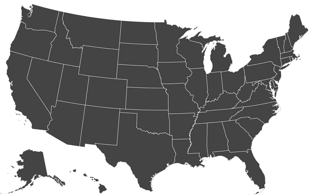</picture><q>Zoom to bounding box</q></a>
<a href="/d3/orthographic-to-equirectangular"><picture><source srcset="../thumbnail/d3/orthographic-to-equirectangular-dark.png" media="(prefers-color-scheme: dark)"></picture><q>Orthographic to equirectangular</q></a>
<a href="/d3/world-tour"><picture><source srcset="../thumbnail/d3/world-tour-dark.png" media="(prefers-color-scheme: dark)"></picture><q>World tour</q></a>
<a href="/d3/walmarts-growth"><picture><source srcset="../thumbnail/d3/walmarts-growth-dark.png" media="(prefers-color-scheme: dark)">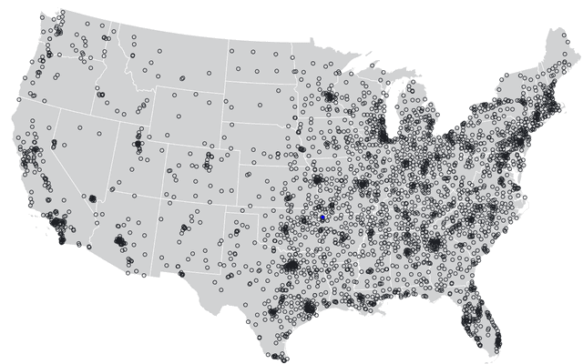</picture><q>Walmart’s growth</q></a>
<a href="/d3/hierarchical-bar-chart"><picture><source srcset="../thumbnail/d3/hierarchical-bar-chart-dark.png" media="(prefers-color-scheme: dark)">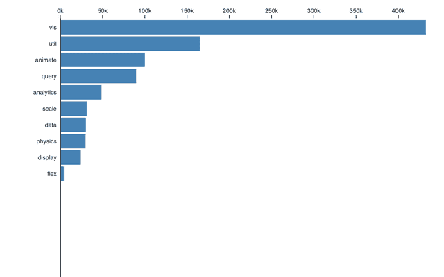</picture><q>Hierarchical bar chart</q></a>
<a href="/d3/zoomable-treemap"><picture><source srcset="../thumbnail/d3/zoomable-treemap-dark.png" media="(prefers-color-scheme: dark)"></picture><q>Zoomable treemap</q></a>
<a href="/d3/zoomable-circle-packing"><picture><source srcset="../thumbnail/d3/zoomable-circle-packing-dark.png" media="(prefers-color-scheme: dark)"></picture><q>Zoomable circle packing</q></a>
<a href="/d3/collapsible-tree"><picture><source srcset="../thumbnail/d3/collapsible-tree-dark.png" media="(prefers-color-scheme: dark)">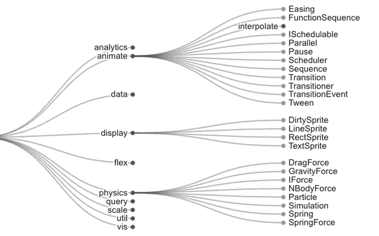</picture><q>Collapsible tree</q></a>
<a href="/d3/zoomable-icicle"><picture><source srcset="../thumbnail/d3/zoomable-icicle-dark.png" media="(prefers-color-scheme: dark)">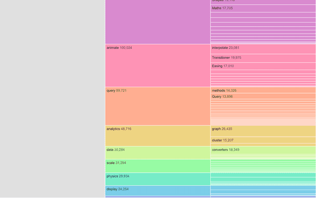</picture><q>Zoomable icicle</q></a>
<a href="/d3/zoomable-sunburst"><picture><source srcset="../thumbnail/d3/zoomable-sunburst-dark.png" media="(prefers-color-scheme: dark)">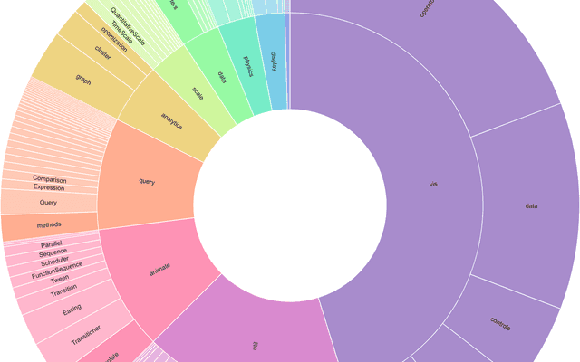</picture><q>Zoomable sunburst</q></a>
<a href="/d3/bar-chart-transitions"><picture><source srcset="../thumbnail/d3/bar-chart-transitions-dark.png" media="(prefers-color-scheme: dark)"></picture><q>Bar chart transitions</q></a>
<a href="/d3/icelandic-population-by-age-1841-2019"><picture><source srcset="../thumbnail/d3/icelandic-population-by-age-1841-2019-dark.png" media="(prefers-color-scheme: dark)">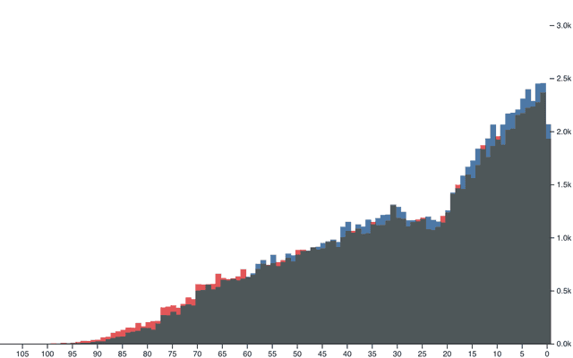</picture><q>Icelandic population by age, 1841–2019</q></a>

## Interaction

D3’s low-level approach allows for performant incremental updates during interaction. And D3 supports popular interaction methods including [dragging](https://d3js.org/d3-drag), [brushing](https://d3js.org/d3-brush), and [zooming](https://d3js.org/d3-zoom).

<a href="/d3/versor-dragging"><picture><source srcset="../thumbnail/d3/versor-dragging-dark.png" media="(prefers-color-scheme: dark)"></picture><q>Versor dragging</q></a>
<a href="/d3/index-chart"><picture><source srcset="../thumbnail/d3/index-chart-dark.png" media="(prefers-color-scheme: dark)">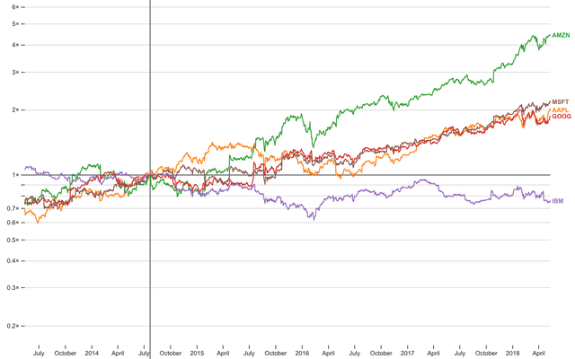</picture><q>Index chart</q></a>
<a href="/d3/sequences-sunburst"><picture><source srcset="../thumbnail/d3/sequences-sunburst-dark.png" media="(prefers-color-scheme: dark)">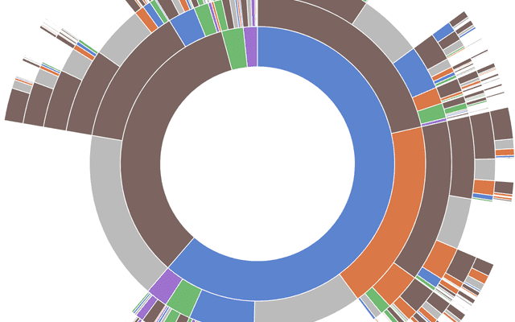</picture><q>Sequences Sunburst</q></a>
<a href="/d3/brushable-scatterplot"><picture><source srcset="../thumbnail/d3/brushable-scatterplot-dark.png" media="(prefers-color-scheme: dark)"></picture><q>Brushable scatterplot</q></a>
<a href="/d3/brushable-scatterplot-matrix"><picture><source srcset="../thumbnail/d3/brushable-scatterplot-matrix-dark.png" media="(prefers-color-scheme: dark)"></picture><q>Brushable scatterplot matrix</q></a>
<a href="/d3/pannable-chart"><picture><source srcset="../thumbnail/d3/pannable-chart-dark.png" media="(prefers-color-scheme: dark)"></picture><q>Pannable chart</q></a>
<a href="/d3/zoomable-area-chart"><picture><source srcset="../thumbnail/d3/zoomable-area-chart-dark.png" media="(prefers-color-scheme: dark)">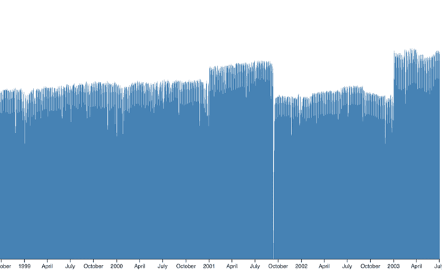</picture><q>Zoomable area chart</q></a>
<a href="/d3/zoomable-bar-chart"><picture><source srcset="../thumbnail/d3/zoomable-bar-chart-dark.png" media="(prefers-color-scheme: dark)"></picture><q>Zoomable bar chart</q></a>
<a href="/d3/seamless-zoomable-map-tiles"><picture><source srcset="../thumbnail/d3/seamless-zoomable-map-tiles-dark.png" media="(prefers-color-scheme: dark)">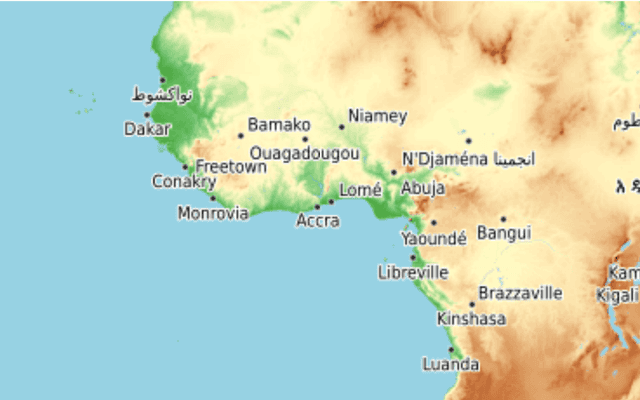</picture><q>Seamless zoomable map tiles</q></a>

## Analysis

D3 is for more than visualization; it includes tools for quantitative analysis, such as [data transformation](https://d3js.org/d3-array), [random number generation](https://d3js.org/d3-random), [hexagonal binning](https://observablehq.com/collection/@d3/d3-hexbin), and [contours via marching squares](https://d3js.org/d3-contour).

<a href="/d3/moving-average"><picture><source srcset="../thumbnail/d3/moving-average-dark.png" media="(prefers-color-scheme: dark)"></picture><q>Moving average</q></a>
<a href="/d3/bollinger-bands"><picture><source srcset="../thumbnail/d3/bollinger-bands-dark.png" media="(prefers-color-scheme: dark)">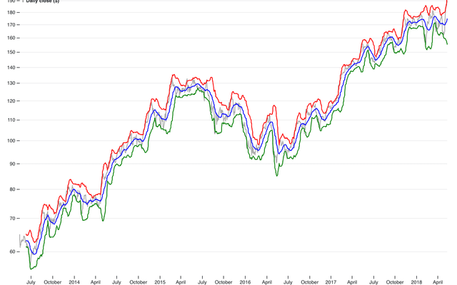</picture><q>Bollinger bands</q></a>
<a href="/d3/box-plot"><picture><source srcset="../thumbnail/d3/box-plot-dark.png" media="(prefers-color-scheme: dark)">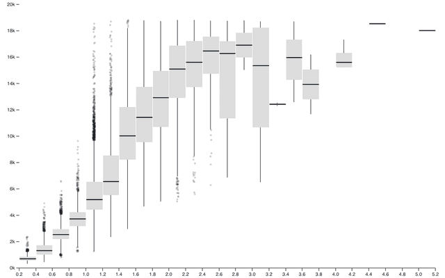</picture><q>Box plot</q></a>
<a href="/d3/histogram"><picture><source srcset="../thumbnail/d3/histogram-dark.png" media="(prefers-color-scheme: dark)"></picture><q>Histogram</q></a>
<a href="/d3/kernel-density-estimation"><picture><source srcset="../thumbnail/d3/kernel-density-estimation-dark.png" media="(prefers-color-scheme: dark)">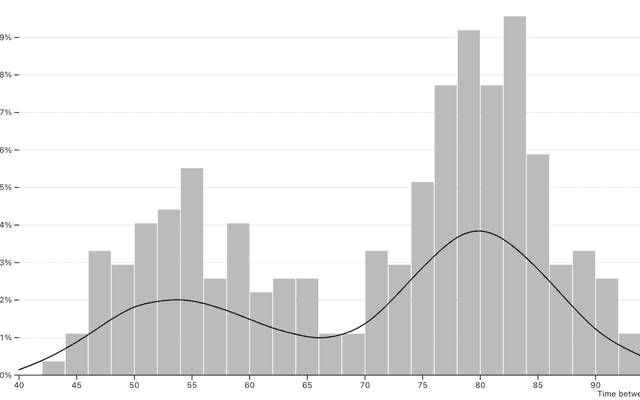</picture><q>Kernel density estimation</q></a>
<a href="/d3/density-contours"><picture><source srcset="../thumbnail/d3/density-contours-dark.png" media="(prefers-color-scheme: dark)">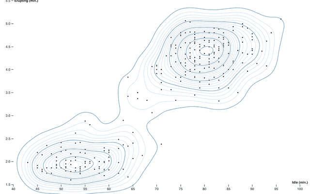</picture><q>Density contours</q></a>
<a href="/d3/volcano-contours"><picture><source srcset="../thumbnail/d3/volcano-contours-dark.png" media="(prefers-color-scheme: dark)">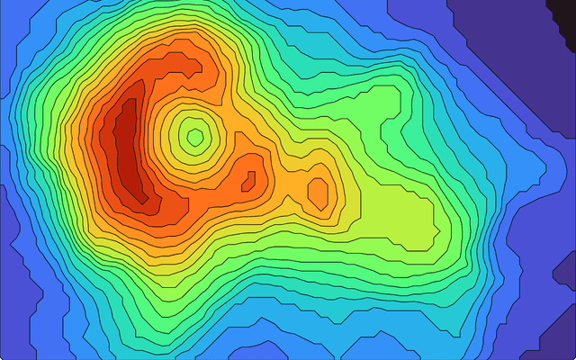</picture><q>Volcano contours</q></a>
<a href="/d3/function-contours"><picture><source srcset="../thumbnail/d3/function-contours-dark.png" media="(prefers-color-scheme: dark)">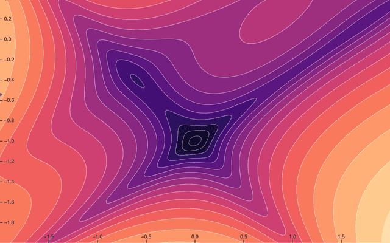</picture><q>Function contours</q></a>
<a href="/d3/hexbin"><picture><source srcset="../thumbnail/d3/hexbin-dark.png" media="(prefers-color-scheme: dark)"></picture><q>Hexbin</q></a>
<a href="/d3/hexbin-area"><picture><source srcset="../thumbnail/d3/hexbin-area-dark.png" media="(prefers-color-scheme: dark)">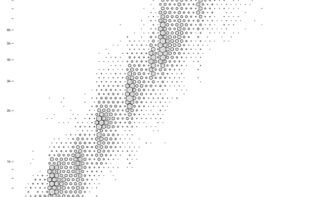</picture><q>Hexbin (area)</q></a>
<a href="/d3/hexbin-map"><picture><source srcset="../thumbnail/d3/hexbin-map-dark.png" media="(prefers-color-scheme: dark)">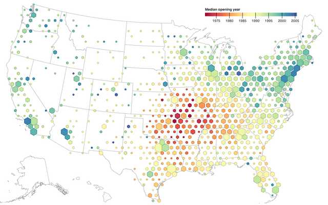</picture><q>Hexbin map</q></a>
<a href="/d3/q-q-plot"><picture><source srcset="../thumbnail/d3/q-q-plot-dark.png" media="(prefers-color-scheme: dark)"></picture><q>Q–Q Plot</q></a>
<a href="/d3/normal-quantile-plot"><picture><source srcset="../thumbnail/d3/normal-quantile-plot-dark.png" media="(prefers-color-scheme: dark)">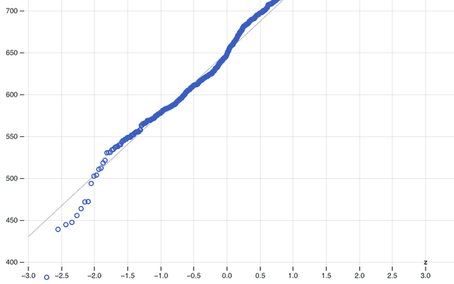</picture><q>Normal quantile plot</q></a>
<a href="/d3/parallel-sets"><picture><source srcset="../thumbnail/d3/parallel-sets-dark.png" media="(prefers-color-scheme: dark)"></picture><q>Parallel sets</q></a>

## Hierarchies

D3 supports [hierarchical data](https://d3js.org/d3-hierarchy), too, with popular layouts such as [treemaps](https://d3js.org/d3-hierarchy/treemap), [tidy trees](https://d3js.org/d3-hierarchy/tree), and [packed circles](https://d3js.org/d3-hierarchy/pack). And you retain complete control over how the data is displayed.

<a href="/d3/treemap"><picture><source srcset="../thumbnail/d3/treemap-dark.png" media="(prefers-color-scheme: dark)"></picture><q>Treemap</q></a>
<a href="/d3/cascaded-treemap"><picture><source srcset="../thumbnail/d3/cascaded-treemap-dark.png" media="(prefers-color-scheme: dark)"></picture><q>Cascaded treemap</q></a>
<a href="/d3/nested-treemap"><picture><source srcset="../thumbnail/d3/nested-treemap-dark.png" media="(prefers-color-scheme: dark)"></picture><q>Nested treemap</q></a>
<a href="/d3/pack"><picture><source srcset="../thumbnail/d3/pack-dark.png" media="(prefers-color-scheme: dark)">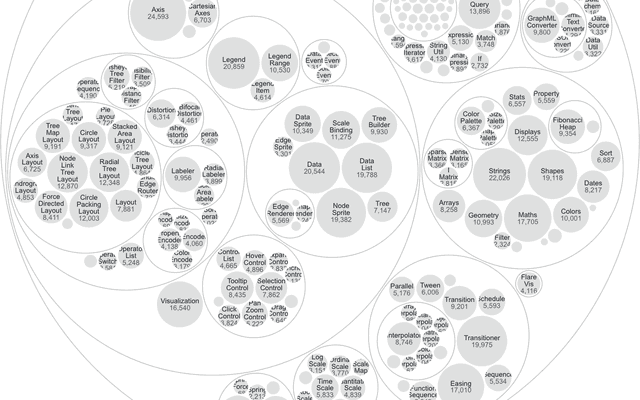</picture><q>Circle packing</q></a>
<a href="/d3/indented-tree"><picture><source srcset="../thumbnail/d3/indented-tree-dark.png" media="(prefers-color-scheme: dark)">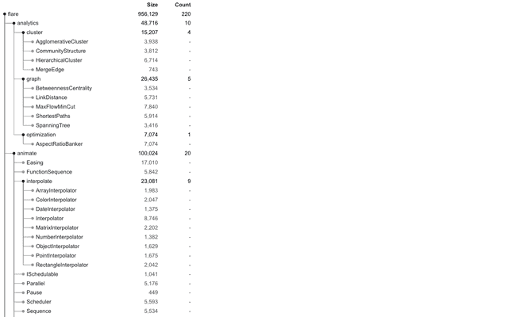</picture><q>Indented tree</q></a>
<a href="/d3/tree"><picture><source srcset="../thumbnail/d3/tree-dark.png" media="(prefers-color-scheme: dark)"></picture><q>Tidy tree</q></a>
<a href="/d3/radial-tree"><picture><source srcset="../thumbnail/d3/radial-tree-dark.png" media="(prefers-color-scheme: dark)"></picture><q>Radial tidy tree</q></a>
<a href="/d3/cluster"><picture><source srcset="../thumbnail/d3/cluster-dark.png" media="(prefers-color-scheme: dark)">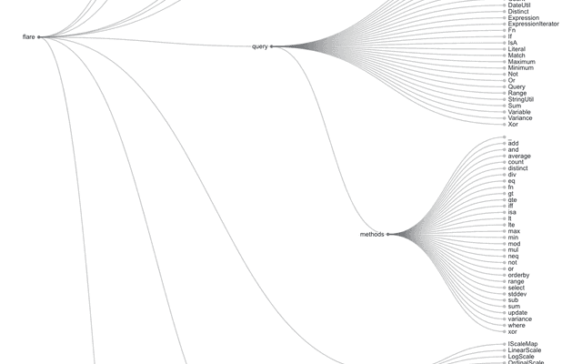</picture><q>Cluster tree</q></a>
<a href="/d3/radial-cluster"><picture><source srcset="../thumbnail/d3/radial-cluster-dark.png" media="(prefers-color-scheme: dark)">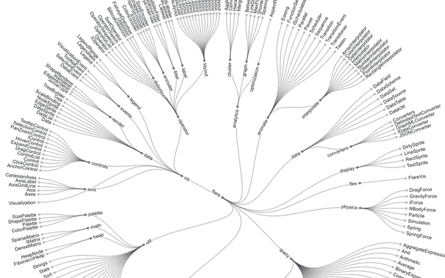</picture><q>Radial cluster tree</q></a>
<a href="/d3/sunburst"><picture><source srcset="../thumbnail/d3/sunburst-dark.png" media="(prefers-color-scheme: dark)"></picture><q>Sunburst</q></a>
<a href="/d3/icicle"><picture><source srcset="../thumbnail/d3/icicle-dark.png" media="(prefers-color-scheme: dark)">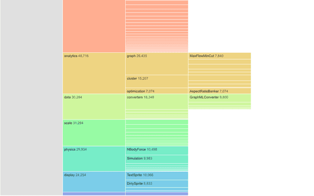</picture><q>Icicle</q></a>
<a href="/d3/tangled-tree"><picture><source srcset="../thumbnail/d3/tangled-tree-dark.png" media="(prefers-color-scheme: dark)">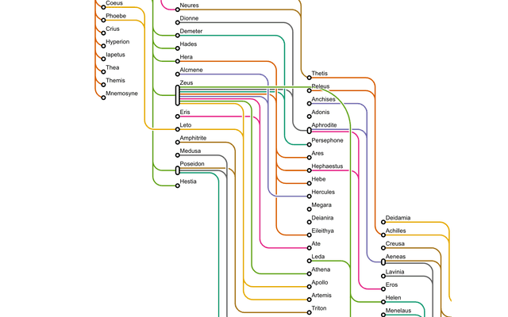</picture><q>Tangled tree</q></a>
<a href="/d3/tree-of-life"><picture><source srcset="../thumbnail/d3/tree-of-life-dark.png" media="(prefers-color-scheme: dark)"></picture><q>Tree of Life</q></a>
<a href="/d3/force-directed-tree"><picture><source srcset="../thumbnail/d3/force-directed-tree-dark.png" media="(prefers-color-scheme: dark)"></picture><q>Force-directed tree</q></a>

## Networks

D3 works with networked data (graphs), including [simulated forces](https://d3js.org/d3-force) for resolving competing constraints and an iterative [Sankey layout](https://observablehq.com/collection/@d3/d3-sankey).

<a href="/d3/force-directed-graph"><picture><source srcset="../thumbnail/d3/force-directed-graph-dark.png" media="(prefers-color-scheme: dark)">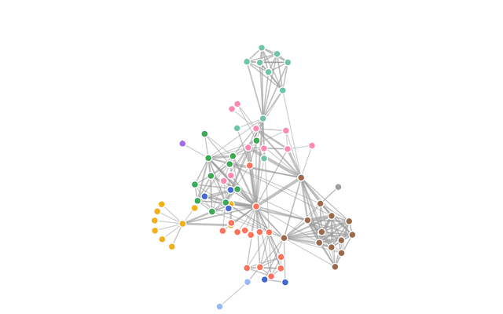</picture><q>Force-directed graph</q></a>
<a href="/d3/disjoint-force-directed-graph"><picture><source srcset="../thumbnail/d3/disjoint-force-directed-graph-dark.png" media="(prefers-color-scheme: dark)"></picture><q>Disjoint force-directed graph</q></a>
<a href="/d3/mobile-patent-suits"><picture><source srcset="../thumbnail/d3/mobile-patent-suits-dark.png" media="(prefers-color-scheme: dark)">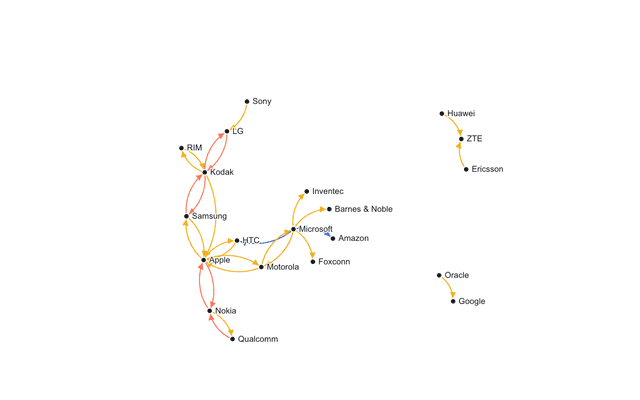</picture><q>Mobile patent suits</q></a>
<a href="/d3/arc-diagram"><picture><source srcset="../thumbnail/d3/arc-diagram-dark.png" media="(prefers-color-scheme: dark)">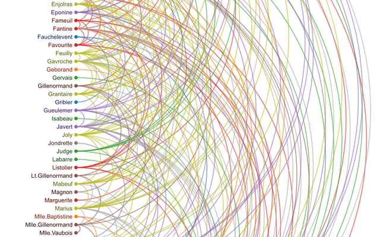</picture><q>Arc diagram</q></a>
<a href="/d3/sankey"><picture><source srcset="../thumbnail/d3/sankey-dark.png" media="(prefers-color-scheme: dark)"></picture><q>Sankey diagram</q></a>
<a href="/d3/hierarchical-edge-bundling"><picture><source srcset="../thumbnail/d3/hierarchical-edge-bundling-dark.png" media="(prefers-color-scheme: dark)">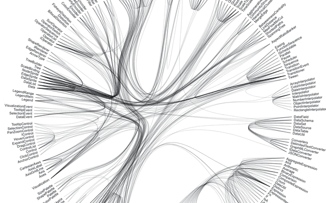</picture><q>Hierarchical edge bundling</q></a>
<a href="/d3/chord-diagram"><picture><source srcset="../thumbnail/d3/chord-diagram-dark.png" media="(prefers-color-scheme: dark)"></picture><q>Chord diagram</q></a>
<a href="/d3/directed-chord-diagram"><picture><source srcset="../thumbnail/d3/directed-chord-diagram-dark.png" media="(prefers-color-scheme: dark)">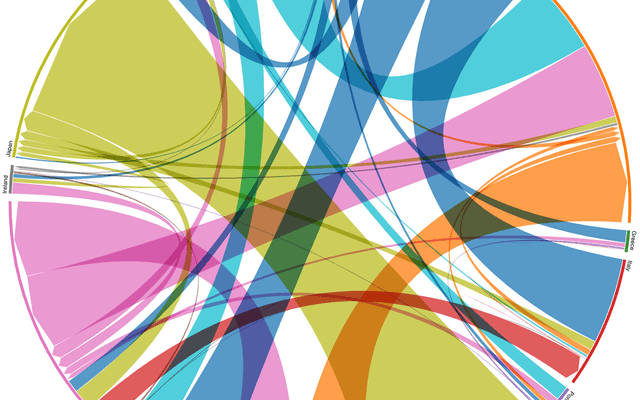</picture><q>Directed chord diagram</q></a>
<a href="/d3/chord-dependency-diagram"><picture><source srcset="../thumbnail/d3/chord-dependency-diagram-dark.png" media="(prefers-color-scheme: dark)"></picture><q>Chord dependency diagram</q></a>

## Bars

D3 [scales](https://d3js.org/d3-scale) and [axes](https://d3js.org/d3-axis) support basic charts. Or invent a new form that better serves your needs.

<a href="/d3/bar-chart"><picture><source srcset="../thumbnail/d3/bar-chart-dark.png" media="(prefers-color-scheme: dark)"></picture><q>Bar chart</q></a>
<a href="/d3/horizontal-bar-chart"><picture><source srcset="../thumbnail/d3/horizontal-bar-chart-dark.png" media="(prefers-color-scheme: dark)">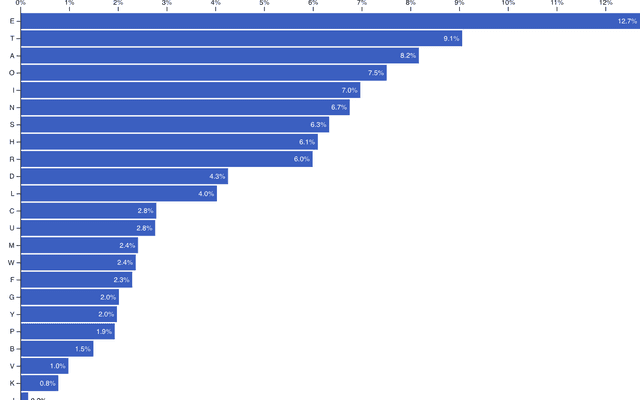</picture><q>Horizontal bar chart</q></a>
<a href="/d3/diverging-bar-chart"><picture><source srcset="../thumbnail/d3/diverging-bar-chart-dark.png" media="(prefers-color-scheme: dark)"></picture><q>Diverging bar chart</q></a>
<a href="/d3/stacked-bar-chart"><picture><source srcset="../thumbnail/d3/stacked-bar-chart-dark.png" media="(prefers-color-scheme: dark)">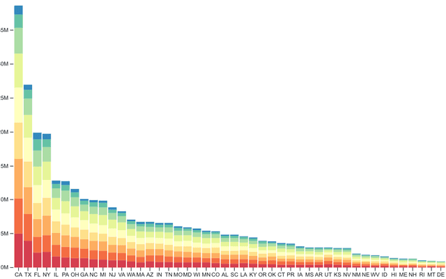</picture><q>Stacked bar chart</q></a>
<a href="/d3/stacked-horizontal-bar-chart"><picture><source srcset="../thumbnail/d3/stacked-horizontal-bar-chart-dark.png" media="(prefers-color-scheme: dark)">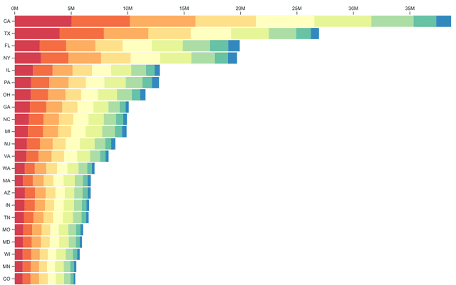</picture><q>Stacked bar chart, horizontal</q></a>
<a href="/d3/stacked-normalized-horizontal-bar"><picture><source srcset="../thumbnail/d3/stacked-normalized-horizontal-bar-dark.png" media="(prefers-color-scheme: dark)">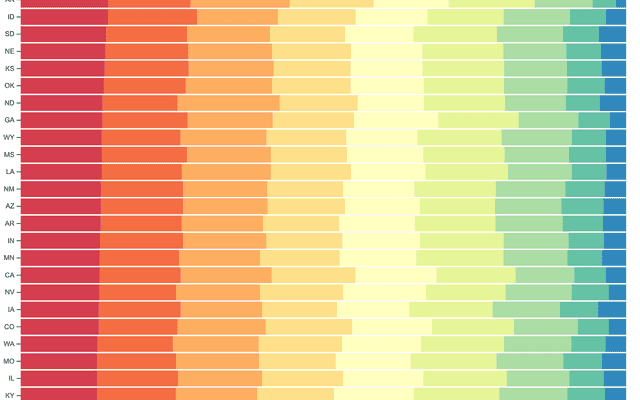</picture><q>Stacked bar chart, normalized</q></a>
<a href="/d3/grouped-bar-chart"><picture><source srcset="../thumbnail/d3/grouped-bar-chart-dark.png" media="(prefers-color-scheme: dark)"></picture><q>Grouped bar chart</q></a>
<a href="/d3/diverging-stacked-bar-chart"><picture><source srcset="../thumbnail/d3/diverging-stacked-bar-chart-dark.png" media="(prefers-color-scheme: dark)"></picture><q>Diverging stacked bar chart</q></a>
<a href="/d3/marimekko"><picture><source srcset="../thumbnail/d3/marimekko-dark.png" media="(prefers-color-scheme: dark)"></picture><q>Marimekko</q></a>
<a href="/d3/world-history-timeline"><picture><source srcset="../thumbnail/d3/world-history-timeline-dark.png" media="(prefers-color-scheme: dark)">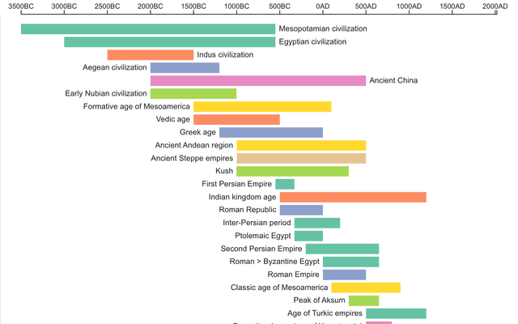</picture><q>World history timeline</q></a>
<a href="/d3/calendar"><picture><source srcset="../thumbnail/d3/calendar-dark.png" media="(prefers-color-scheme: dark)">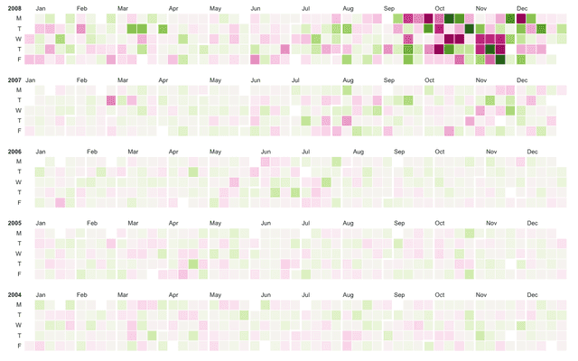</picture><q>Calendar</q></a>
<a href="/d3/impact-of-vaccines"><picture><source srcset="../thumbnail/d3/impact-of-vaccines-dark.png" media="(prefers-color-scheme: dark)">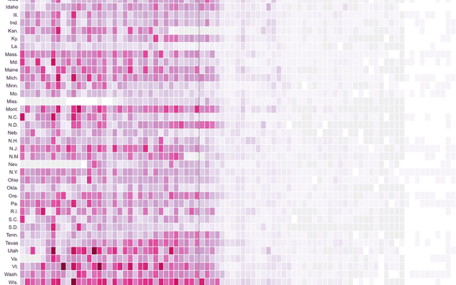</picture><q>The impact of vaccines</q></a>
<a href="/d3/electric-usage-2019"><picture><source srcset="../thumbnail/d3/electric-usage-2019-dark.png" media="(prefers-color-scheme: dark)">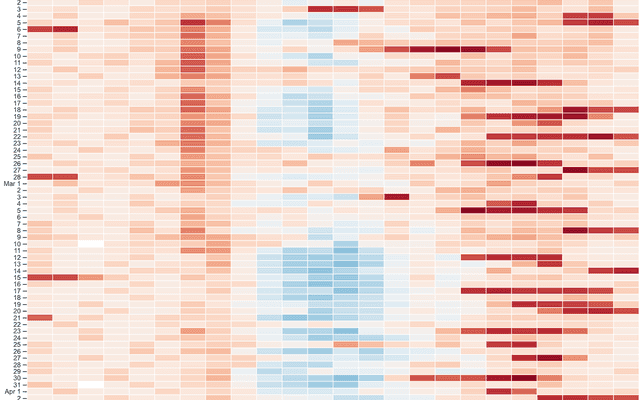</picture><q>Electricity Usage, 2019</q></a>
<a href="/d3/revenue-by-music-format-1973-2018"><picture><source srcset="../thumbnail/d3/revenue-by-music-format-1973-2018-dark.png" media="(prefers-color-scheme: dark)">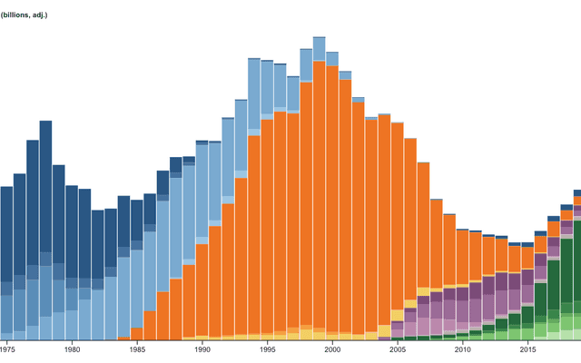</picture><q>Revenue by music format, 1973–2018</q></a>

## Lines

With direct control over [graphics](https://d3js.org/d3-shape), and support for both SVG and Canvas, the possibilities are endless.

<a href="/d3/line-chart"><picture><source srcset="../thumbnail/d3/line-chart-dark.png" media="(prefers-color-scheme: dark)">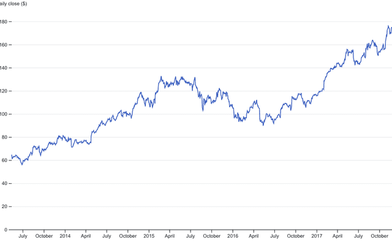</picture><q>Line chart</q></a>
<a href="/d3/line-chart-missing-data"><picture><source srcset="../thumbnail/d3/line-chart-missing-data-dark.png" media="(prefers-color-scheme: dark)">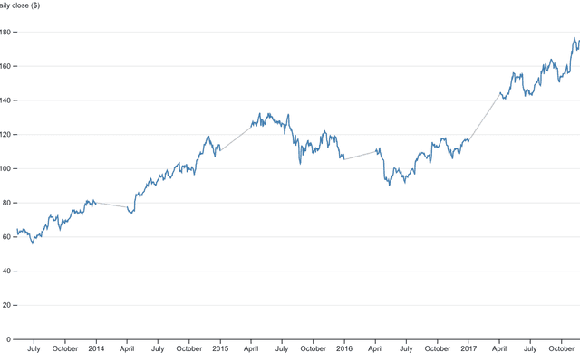</picture><q>Line chart, missing data</q></a>
<a href="/d3/multi-line-chart"><picture><source srcset="../thumbnail/d3/multi-line-chart-dark.png" media="(prefers-color-scheme: dark)"></picture><q>Line chart, multiple series</q></a>
<a href="/d3/change-line-chart"><picture><source srcset="../thumbnail/d3/change-line-chart-dark.png" media="(prefers-color-scheme: dark)">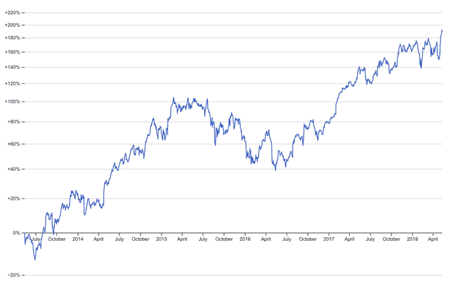</picture><q>Line chart, percent change</q></a>
<a href="/d3/slope-chart"><picture><source srcset="../thumbnail/d3/slope-chart-dark.png" media="(prefers-color-scheme: dark)">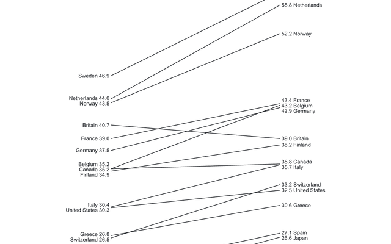</picture><q>Slope chart</q></a>
<a href="/d3/cancer-survival-rates"><picture><source srcset="../thumbnail/d3/cancer-survival-rates-dark.png" media="(prefers-color-scheme: dark)">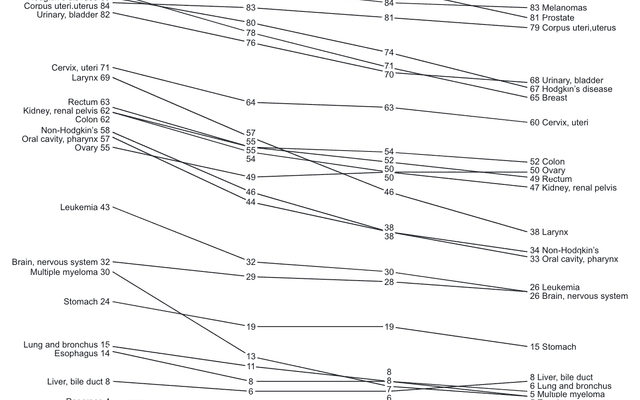</picture><q>Cancer survival rates</q></a>
<a href="/d3/mareys-trains"><picture><source srcset="../thumbnail/d3/mareys-trains-dark.png" media="(prefers-color-scheme: dark)"></picture><q>Marey’s trains</q></a>
<a href="/d3/candlestick-chart"><picture><source srcset="../thumbnail/d3/candlestick-chart-dark.png" media="(prefers-color-scheme: dark)"></picture><q>Candlestick chart</q></a>
<a href="/d3/variable-color-line"><picture><source srcset="../thumbnail/d3/variable-color-line-dark.png" media="(prefers-color-scheme: dark)"></picture><q>Variable-color line</q></a>
<a href="/d3/gradient-encoding"><picture><source srcset="../thumbnail/d3/gradient-encoding-dark.png" media="(prefers-color-scheme: dark)">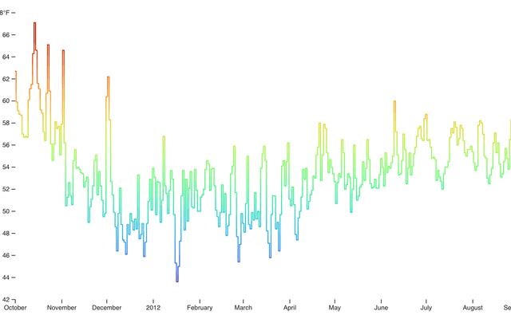</picture><q>Gradient encoding</q></a>
<a href="/d3/threshold-encoding"><picture><source srcset="../thumbnail/d3/threshold-encoding-dark.png" media="(prefers-color-scheme: dark)">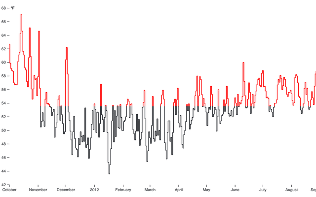</picture><q>Threshold encoding</q></a>
<a href="/d3/parallel-coordinates"><picture><source srcset="../thumbnail/d3/parallel-coordinates-dark.png" media="(prefers-color-scheme: dark)">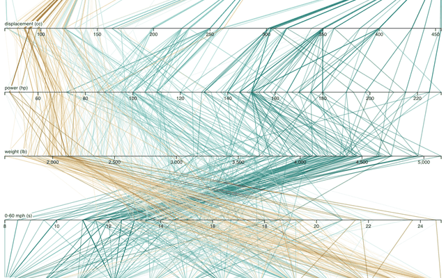</picture><q>Parallel coordinates</q></a>
<a href="/d3/inequality-in-american-cities"><picture><source srcset="../thumbnail/d3/inequality-in-american-cities-dark.png" media="(prefers-color-scheme: dark)">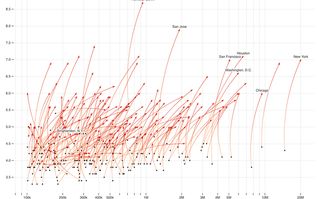</picture><q>Inequality in American cities</q></a>
<a href="/d3/new-zealand-tourists-1921-2018"><picture><source srcset="../thumbnail/d3/new-zealand-tourists-1921-2018-dark.png" media="(prefers-color-scheme: dark)">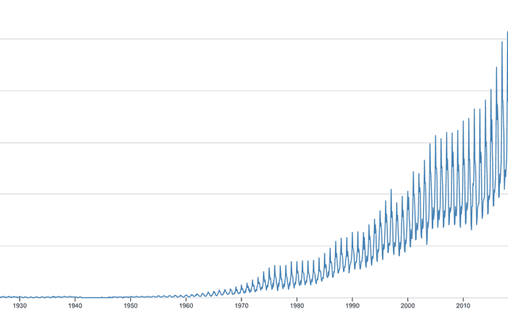</picture><q>New Zealand tourists, 1921–2018</q></a>
<a href="/d3/sea-ice-extent-1978-2017"><picture><source srcset="../thumbnail/d3/sea-ice-extent-1978-2017-dark.png" media="(prefers-color-scheme: dark)">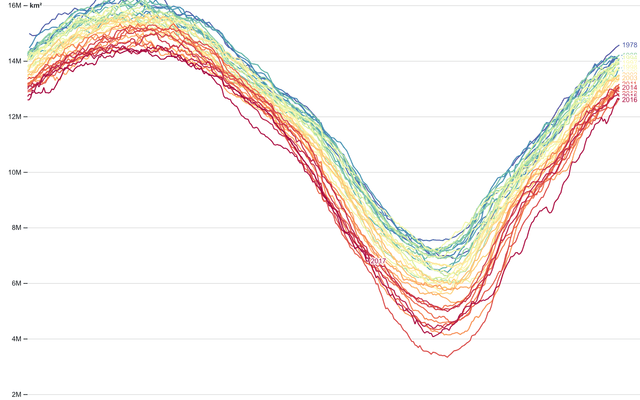</picture><q>Sea ice extent, 1978–2017</q></a>

## Areas

Go beyond basic area charts with [difference charts](/d3/difference-chart) or [streamgraphs](/d3/streamgraph). [Ridgeline plots](/d3/ridgeline-plots) and [horizon charts](/d3/horizon-charts) are great for comparing many simultaneous time series.

<a href="/d3/area-chart"><picture><source srcset="../thumbnail/d3/area-chart-dark.png" media="(prefers-color-scheme: dark)"></picture><q>Area chart</q></a>
<a href="/d3/area-chart-missing-data"><picture><source srcset="../thumbnail/d3/area-chart-missing-data-dark.png" media="(prefers-color-scheme: dark)"></picture><q>Area chart with missing data</q></a>
<a href="/d3/stacked-area-chart"><picture><source srcset="../thumbnail/d3/stacked-area-chart-dark.png" media="(prefers-color-scheme: dark)">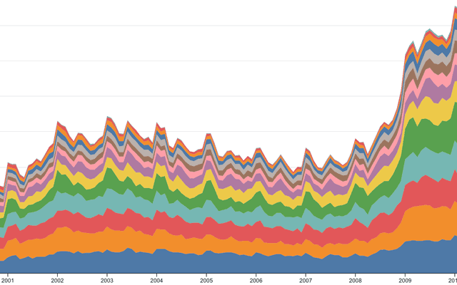</picture><q>Stacked area chart</q></a>
<a href="/d3/normalized-stacked-area-chart"><picture><source srcset="../thumbnail/d3/normalized-stacked-area-chart-dark.png" media="(prefers-color-scheme: dark)">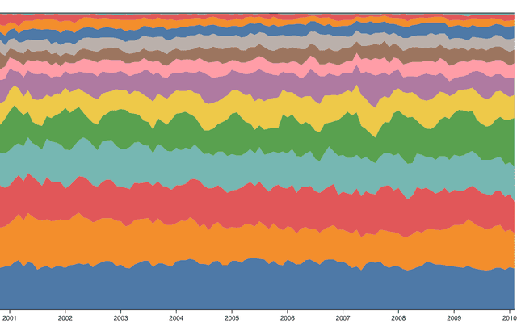</picture><q>Normalized stacked area chart</q></a>
<a href="/d3/u-s-population-by-state-1790-1990"><picture><source srcset="../thumbnail/d3/u-s-population-by-state-1790-1990-dark.png" media="(prefers-color-scheme: dark)">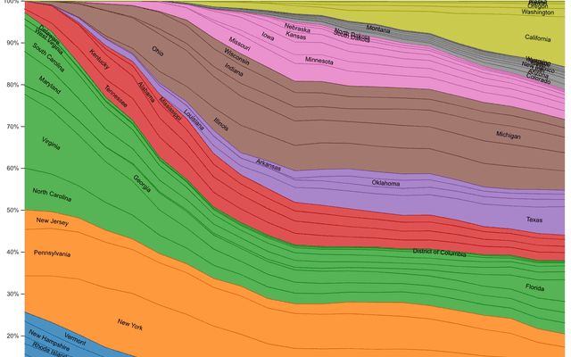</picture><q>U.S. population by State, 1790–1990</q></a>
<a href="/d3/streamgraph"><picture><source srcset="../thumbnail/d3/streamgraph-dark.png" media="(prefers-color-scheme: dark)">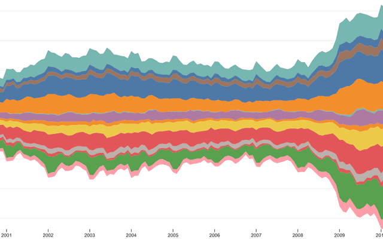</picture><q>Streamgraph</q></a>
<a href="/d3/difference-chart"><picture><source srcset="../thumbnail/d3/difference-chart-dark.png" media="(prefers-color-scheme: dark)">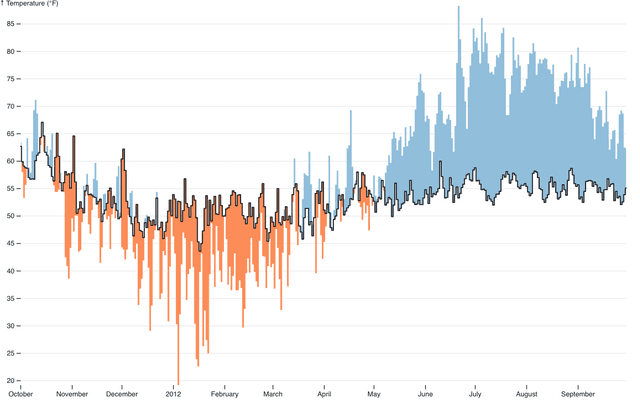</picture><q>Difference chart</q></a>
<a href="/d3/band-chart"><picture><source srcset="../thumbnail/d3/band-chart-dark.png" media="(prefers-color-scheme: dark)">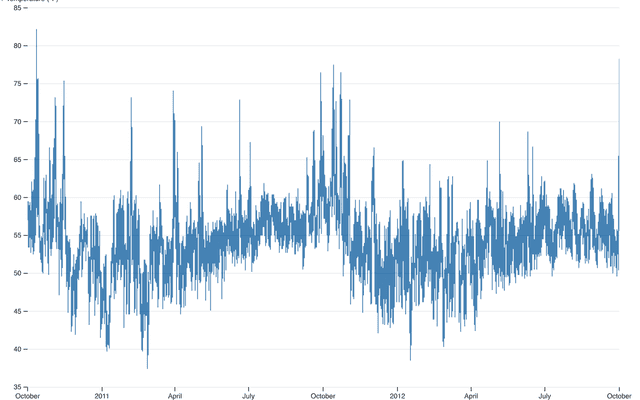</picture><q>Band chart</q></a>
<a href="/d3/ridgeline-plot"><picture><source srcset="../thumbnail/d3/ridgeline-plot-dark.png" media="(prefers-color-scheme: dark)">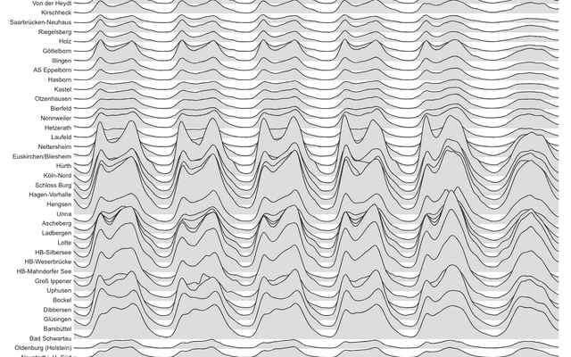</picture><q>Ridgeline plot</q></a>
<a href="/d3/horizon-chart"><picture><source srcset="../thumbnail/d3/horizon-chart-dark.png" media="(prefers-color-scheme: dark)">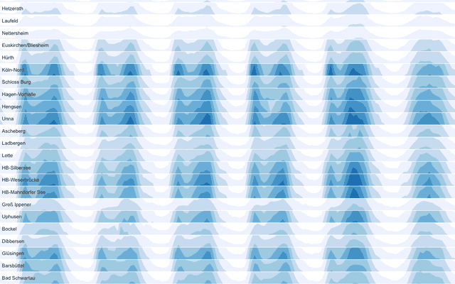</picture><q>Horizon chart</q></a>
<a href="/d3/realtime-horizon-chart"><picture><source srcset="../thumbnail/d3/realtime-horizon-chart-dark.png" media="(prefers-color-scheme: dark)">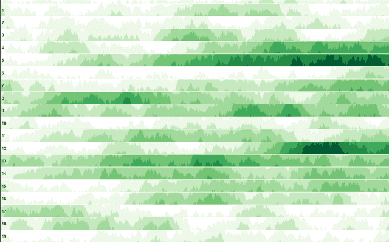</picture><q>Realtime horizon chart</q></a>

## Dots

Don’t forget the humble scatterplot. For a single dimension, consider the [beeswarm](/d3/beeswarm); for finding pairwise dimensional correlations, try a [SPLOM](/d3/splom).

<a href="/d3/scatterplot"><picture><source srcset="../thumbnail/d3/scatterplot-dark.png" media="(prefers-color-scheme: dark)">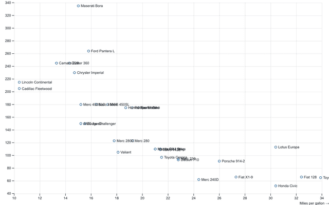</picture><q>Scatterplot</q></a>
<a href="/d3/scatterplot-with-shapes"><picture><source srcset="../thumbnail/d3/scatterplot-with-shapes-dark.png" media="(prefers-color-scheme: dark)">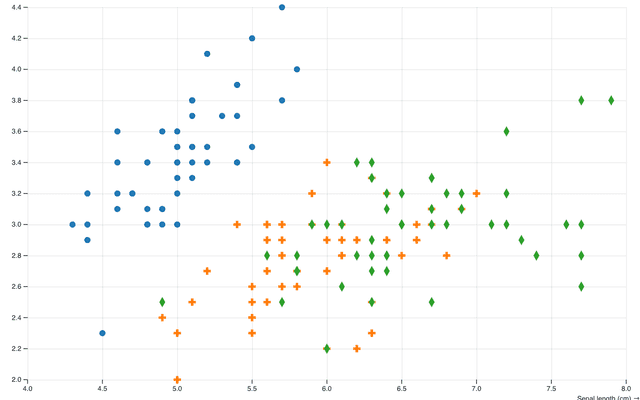</picture><q>Scatterplot with shapes</q></a>
<a href="/d3/splom"><picture><source srcset="../thumbnail/d3/splom-dark.png" media="(prefers-color-scheme: dark)"></picture><q>Scatterplot matrix</q></a>
<a href="/d3/dot-plot"><picture><source srcset="../thumbnail/d3/dot-plot-dark.png" media="(prefers-color-scheme: dark)"></picture><q>Dot plot</q></a>
<a href="/d3/global-temperature-trends"><picture><source srcset="../thumbnail/d3/global-temperature-trends-dark.png" media="(prefers-color-scheme: dark)">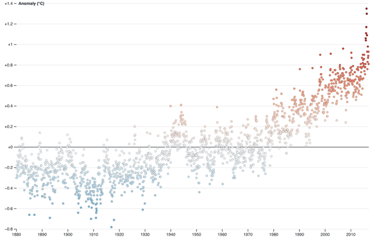</picture><q>Global temperature trends</q></a>
<a href="/d3/bubble-map"><picture><source srcset="../thumbnail/d3/bubble-map-dark.png" media="(prefers-color-scheme: dark)">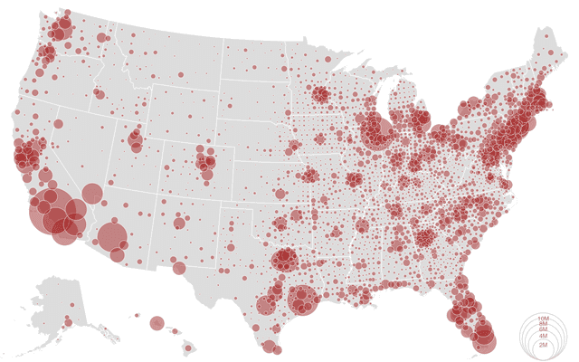</picture><q>Bubble map</q></a>
<a href="/d3/spike-map"><picture><source srcset="../thumbnail/d3/spike-map-dark.png" media="(prefers-color-scheme: dark)">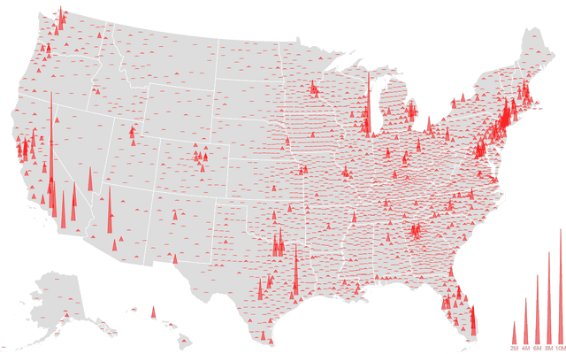</picture><q>Spike map</q></a>
<a href="/d3/bubble-chart"><picture><source srcset="../thumbnail/d3/bubble-chart-dark.png" media="(prefers-color-scheme: dark)"></picture><q>Bubble chart</q></a>
<a href="/d3/beeswarm"><picture><source srcset="../thumbnail/d3/beeswarm-dark.png" media="(prefers-color-scheme: dark)">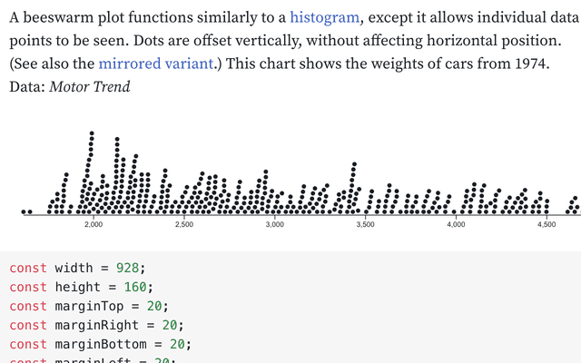</picture><q>Beeswarm</q></a>
<a href="/d3/beeswarm-mirrored"><picture><source srcset="../thumbnail/d3/beeswarm-mirrored-dark.png" media="(prefers-color-scheme: dark)">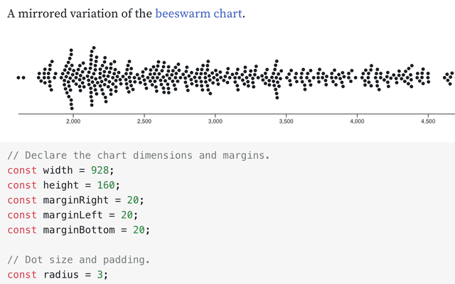</picture><q>Mirrored beeswarm</q></a>
<a href="/d3/hertzsprung-russell-diagram"><picture><source srcset="../thumbnail/d3/hertzsprung-russell-diagram-dark.png" media="(prefers-color-scheme: dark)">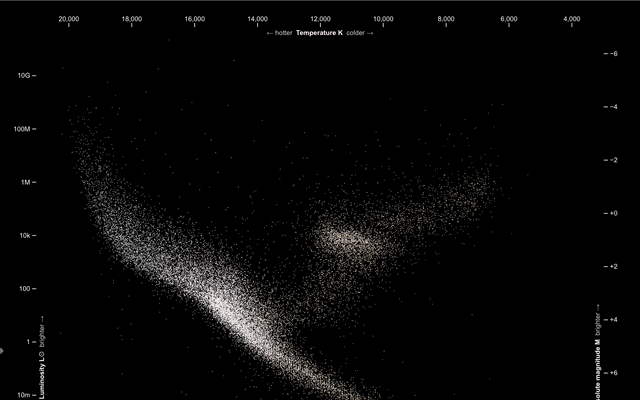</picture><q>Hertzsprung–Russell diagram</q></a>

## Radial

Pies and donuts are good for comparing a part to the whole. And radial layouts can be appropriate for cyclical data.

<a href="/d3/pie-chart"><picture><source srcset="../thumbnail/d3/pie-chart-dark.png" media="(prefers-color-scheme: dark)"></picture><q>Pie chart</q></a>
<a href="/d3/donut-chart"><picture><source srcset="../thumbnail/d3/donut-chart-dark.png" media="(prefers-color-scheme: dark)">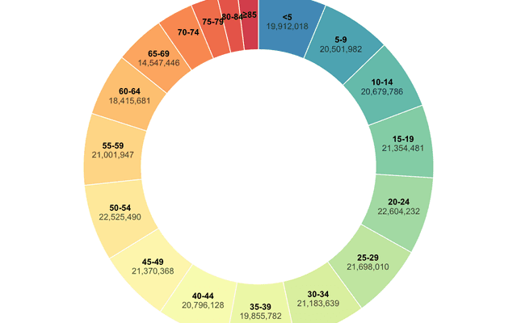</picture><q>Donut chart</q></a>
<a href="/d3/radial-area-chart"><picture><source srcset="../thumbnail/d3/radial-area-chart-dark.png" media="(prefers-color-scheme: dark)">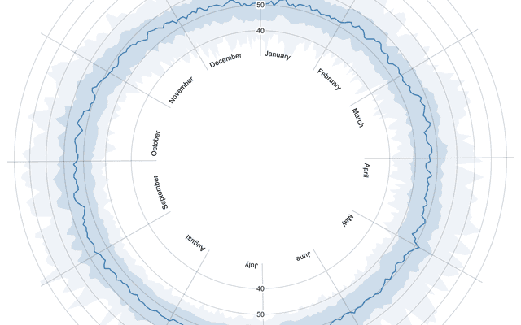</picture><q>Radial area chart</q></a>
<a href="/d3/radial-stacked-bar-chart"><picture><source srcset="../thumbnail/d3/radial-stacked-bar-chart-dark.png" media="(prefers-color-scheme: dark)"></picture><q>Radial stacked bar chart</q></a>

## Annotation

Labels, legends, axes, titles, guides, and keys help a visualization communicate effectively. Here are a few strategies.

<a href="/d3/inline-labels"><picture><source srcset="../thumbnail/d3/inline-labels-dark.png" media="(prefers-color-scheme: dark)"></picture><q>Inline labels</q></a>
<a href="/d3/directly-labelling-lines"><picture><source srcset="../thumbnail/d3/directly-labelling-lines-dark.png" media="(prefers-color-scheme: dark)">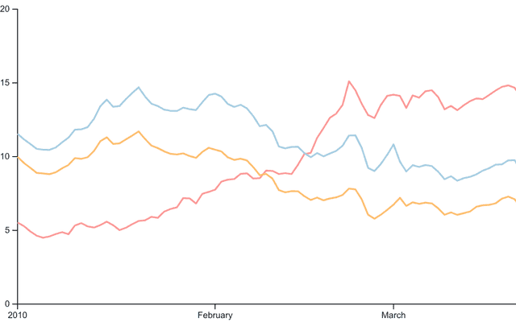</picture><q>Directly labelling lines</q></a>
<a href="/d3/line-with-tooltip"><picture><source srcset="../thumbnail/d3/line-with-tooltip-dark.png" media="(prefers-color-scheme: dark)">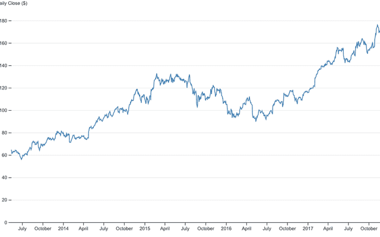</picture><q>Line chart with tooltip</q></a>
<a href="/d3/voronoi-labels"><picture><source srcset="../thumbnail/d3/voronoi-labels-dark.png" media="(prefers-color-scheme: dark)"></picture><q>D3 Voronoi labels</q></a>
<a href="/d3/occlusion"><picture><source srcset="../thumbnail/d3/occlusion-dark.png" media="(prefers-color-scheme: dark)"></picture><q>Occlusion</q></a>

## Maps

D3 implements a dizzying array of [geographic projections](https://observablehq.com/collection/@d3/d3-geo-projection). It works great with [GeoJSON](https://en.wikipedia.org/wiki/GeoJSON), [TopoJSON](https://github.com/topojson), and even [shapefiles](/d3/streaming-shapefiles).

<a href="/d3/graticule-labels-stereographic"><picture><source srcset="../thumbnail/d3/graticule-labels-stereographic-dark.png" media="(prefers-color-scheme: dark)"></picture><q>Graticule labels (stereographic)</q></a>
<a href="/d3/styled-axes"><picture><source srcset="../thumbnail/d3/styled-axes-dark.png" media="(prefers-color-scheme: dark)">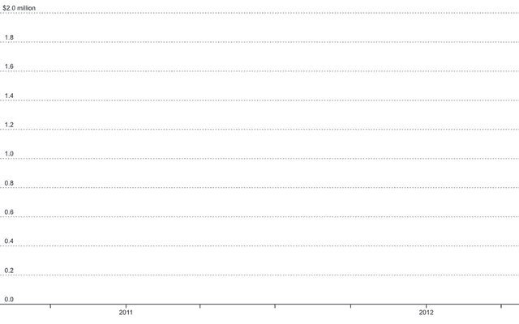</picture><q>Styled axes</q></a>
<a href="/d3/color-legend"><picture><source srcset="../thumbnail/d3/color-legend-dark.png" media="(prefers-color-scheme: dark)">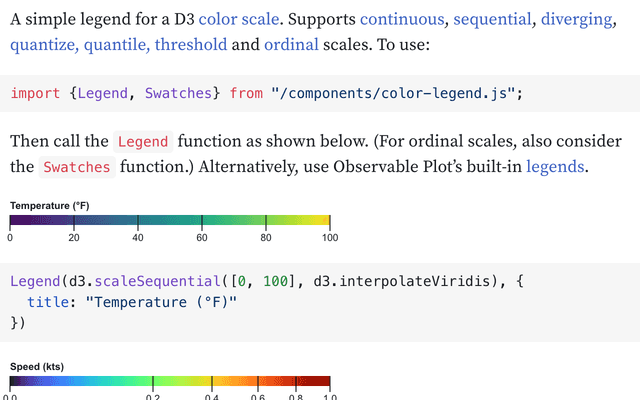</picture><q>Color legend</q></a>
<a href="/d3/choropleth"><picture><source srcset="../thumbnail/d3/choropleth-dark.png" media="(prefers-color-scheme: dark)">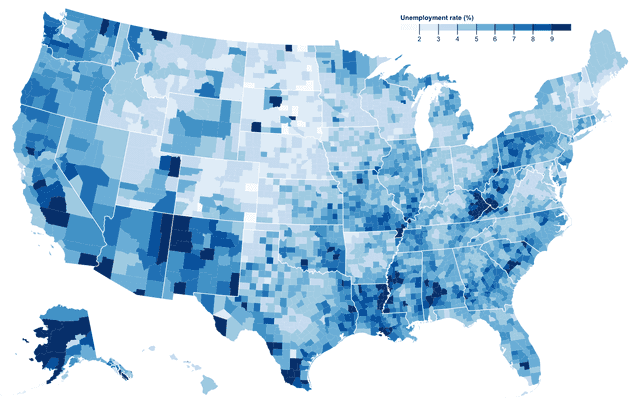</picture><q>Choropleth</q></a>
<a href="/d3/bivariate-choropleth"><picture><source srcset="../thumbnail/d3/bivariate-choropleth-dark.png" media="(prefers-color-scheme: dark)"></picture><q>Bivariate choropleth</q></a>
<a href="/d3/us-state-choropleth"><picture><source srcset="../thumbnail/d3/us-state-choropleth-dark.png" media="(prefers-color-scheme: dark)">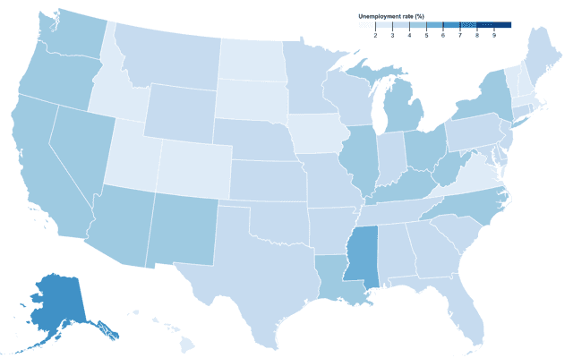</picture><q>U.S. state choropleth</q></a>
<a href="/d3/world-choropleth"><picture><source srcset="../thumbnail/d3/world-choropleth-dark.png" media="(prefers-color-scheme: dark)">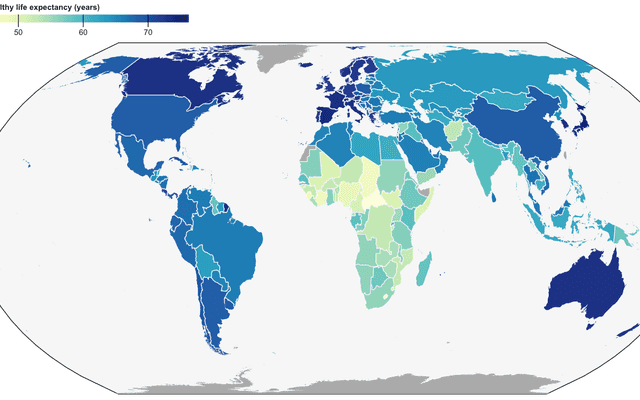</picture><q>World choropleth</q></a>
<a href="/d3/world-map"><picture><source srcset="../thumbnail/d3/world-map-dark.png" media="(prefers-color-scheme: dark)">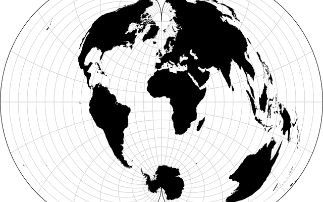</picture><q>World map (canvas)</q></a>
<a href="/d3/projection-comparison"><picture><source srcset="../thumbnail/d3/projection-comparison-dark.png" media="(prefers-color-scheme: dark)"></picture><q>Projection comparison</q></a>
<a href="/d3/tissots-indicatrix"><picture><source srcset="../thumbnail/d3/tissots-indicatrix-dark.png" media="(prefers-color-scheme: dark)">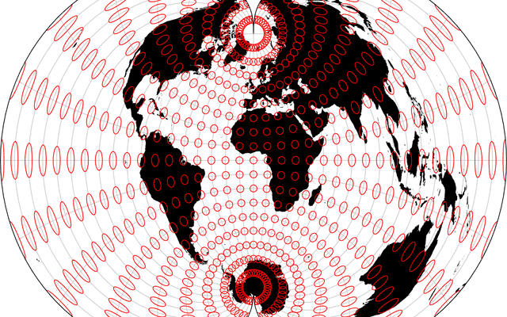</picture><q>Tissot’s indicatrix</q></a>
<a href="/d3/web-mercator-tiles"><picture><source srcset="../thumbnail/d3/web-mercator-tiles-dark.png" media="(prefers-color-scheme: dark)">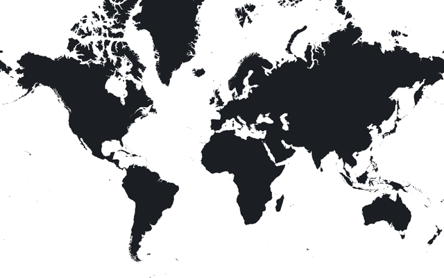</picture><q>Web Mercator tiles</q></a>
<a href="/d3/raster-tiles"><picture><source srcset="../thumbnail/d3/raster-tiles-dark.png" media="(prefers-color-scheme: dark)">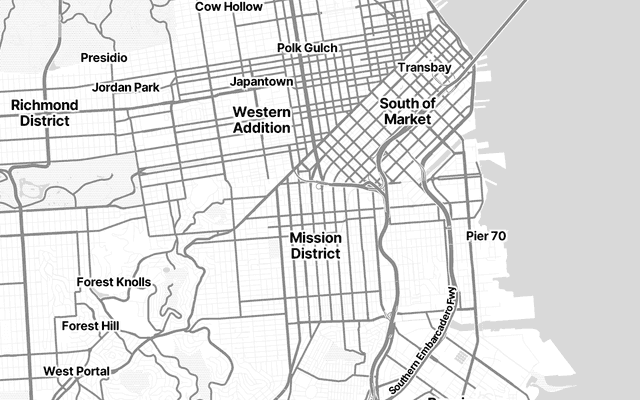</picture><q>Raster tiles</q></a>
<a href="/d3/vector-tiles"><picture><source srcset="../thumbnail/d3/vector-tiles-dark.png" media="(prefers-color-scheme: dark)">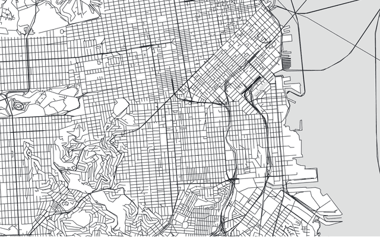</picture><q>D3: Vector tiles</q></a>
<a href="/d3/clipped-map-tiles"><picture><source srcset="../thumbnail/d3/clipped-map-tiles-dark.png" media="(prefers-color-scheme: dark)">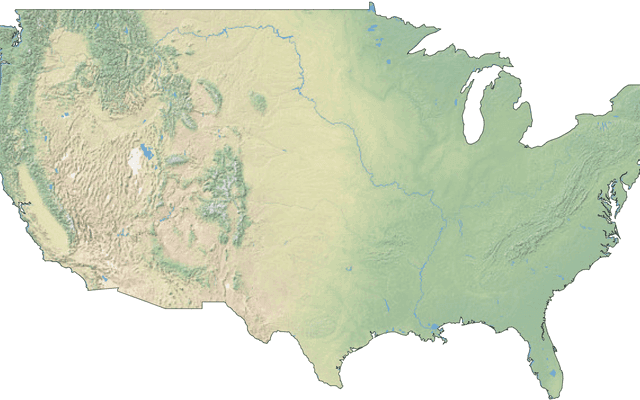</picture><q>Clipped map tiles</q></a>
<a href="/d3/raster-vector"><picture><source srcset="../thumbnail/d3/raster-vector-dark.png" media="(prefers-color-scheme: dark)">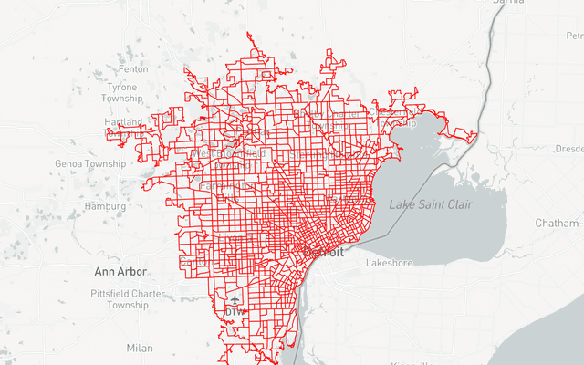</picture><q>Raster & vector</q></a>
<a href="/d3/vector-field"><picture><source srcset="../thumbnail/d3/vector-field-dark.png" media="(prefers-color-scheme: dark)">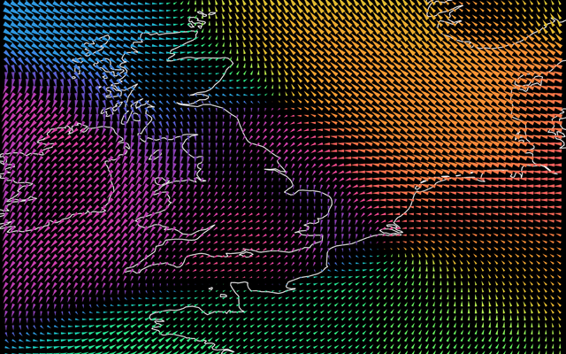</picture><q>Vector field</q></a>
<a href="/d3/geotiff-contours"><picture><source srcset="../thumbnail/d3/geotiff-contours-dark.png" media="(prefers-color-scheme: dark)">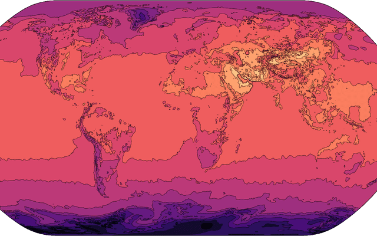</picture><q>GeoTIFF contours</q></a>
<a href="/d3/us-airports-voronoi"><picture><source srcset="../thumbnail/d3/us-airports-voronoi-dark.png" media="(prefers-color-scheme: dark)">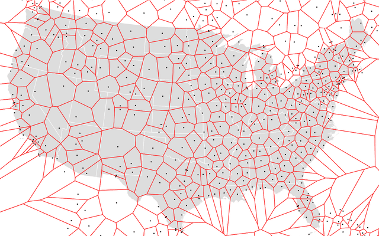</picture><q>U.S. airports Voronoi</q></a>
<a href="/d3/world-airports-voronoi"><picture><source srcset="../thumbnail/d3/world-airports-voronoi-dark.png" media="(prefers-color-scheme: dark)"></picture><q>World airports voronoi</q></a>
<a href="/d3/solar-terminator"><picture><source srcset="../thumbnail/d3/solar-terminator-dark.png" media="(prefers-color-scheme: dark)">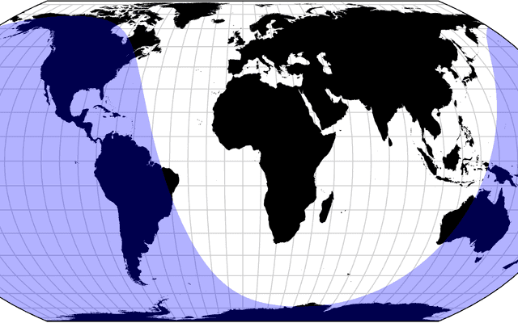</picture><q>Solar Terminator</q></a>
<a href="/d3/solar-path"><picture><source srcset="../thumbnail/d3/solar-path-dark.png" media="(prefers-color-scheme: dark)"></picture><q>Solar path</q></a>
<a href="/d3/star-map"><picture><source srcset="../thumbnail/d3/star-map-dark.png" media="(prefers-color-scheme: dark)"></picture><q>Star map</q></a>
<a href="/d3/non-contiguous-cartogram"><picture><source srcset="../thumbnail/d3/non-contiguous-cartogram-dark.png" media="(prefers-color-scheme: dark)"></picture><q>Non-contiguous cartogram</q></a>

## Essays

Weave interactive visualizations seamlessly into prose for explorable explanations. Don’t just *tell* the reader something; let the reader see, engage, and ask questions.

<a href="/d3/d3-packenclose"><picture><source srcset="../thumbnail/d3/d3-packenclose-dark.png" media="(prefers-color-scheme: dark)">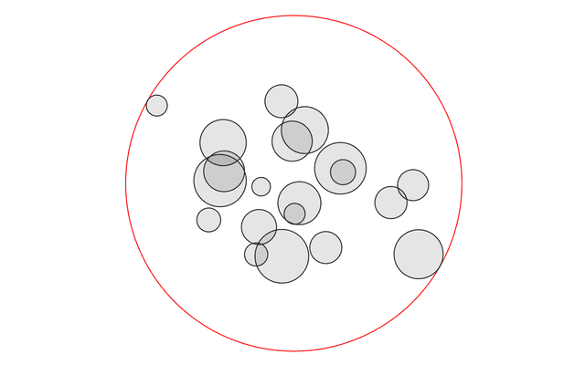</picture><q>d3.packEnclose</q></a>
<a href="/d3/centerline-labeling"><picture><source srcset="../thumbnail/d3/centerline-labeling-dark.png" media="(prefers-color-scheme: dark)"></picture><q>Centerline labeling</q></a>
<a href="/d3/methods-of-comparison-compared"><picture><source srcset="../thumbnail/d3/methods-of-comparison-compared-dark.png" media="(prefers-color-scheme: dark)">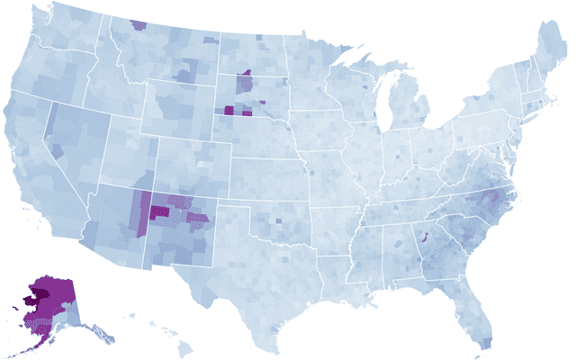</picture><q>Methods of Comparison, Compared</q></a>
<a href="/d3/predator-and-prey"><picture><source srcset="../thumbnail/d3/predator-and-prey-dark.png" media="(prefers-color-scheme: dark)">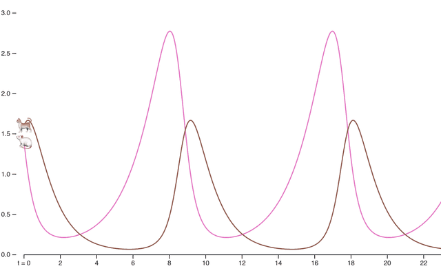</picture><q>Predator and Prey</q></a>

## Just for fun

Why not have a little fun? Life’s not just about work, you know.

<a href="/d3/polar-clock"><picture><source srcset="../thumbnail/d3/polar-clock-dark.png" media="(prefers-color-scheme: dark)">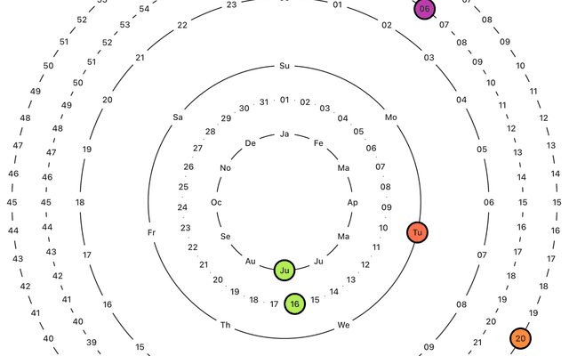</picture><q>Polar clock</q></a>
<a href="/d3/stern-brocot-tree"><picture><source srcset="../thumbnail/d3/stern-brocot-tree-dark.png" media="(prefers-color-scheme: dark)">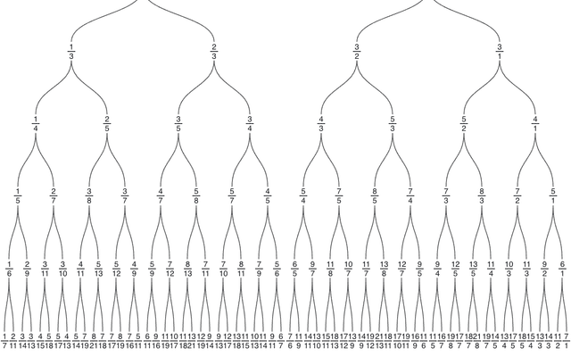</picture><q>Stern–Brocot Tree</q></a>
<a href="/d3/voronoi-stippling"><picture><source srcset="../thumbnail/d3/voronoi-stippling-dark.png" media="(prefers-color-scheme: dark)"></picture><q>Voronoi stippling</q></a>
<a href="/d3/watercolor"><picture><source srcset="../thumbnail/d3/watercolor-dark.png" media="(prefers-color-scheme: dark)"></picture><q>Watercolor</q></a>
<a href="/d3/psr-b1919-21"><picture><source srcset="../thumbnail/d3/psr-b1919-21-dark.png" media="(prefers-color-scheme: dark)">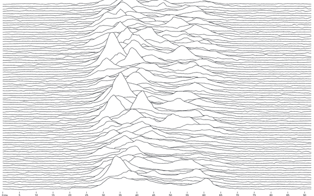</picture><q>PSR B1919+21</q></a>
<a href="/d3/epicyclic-gearing"><picture><source srcset="../thumbnail/d3/epicyclic-gearing-dark.png" media="(prefers-color-scheme: dark)">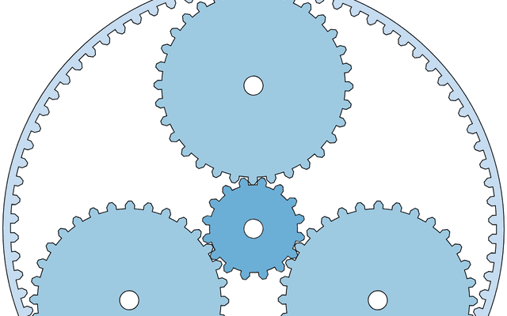</picture><q>Epicyclic gearing</q></a>
<a href="/d3/owls-to-the-max"><picture><source srcset="../thumbnail/d3/owls-to-the-max-dark.png" media="(prefers-color-scheme: dark)"></picture><q>Owls to the Max</q></a>
<a href="/d3/tadpoles"><picture><source srcset="../thumbnail/d3/tadpoles-dark.png" media="(prefers-color-scheme: dark)"></picture><q>Tadpoles</q></a>
<a href="/d3/wordcloud"><picture><source srcset="../thumbnail/d3/wordcloud-dark.png" media="(prefers-color-scheme: dark)">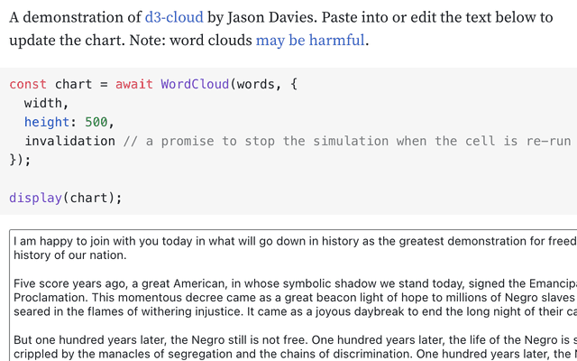</picture><q>Word cloud</q></a>
<a href="/d3/spilhaus-shoreline-map"><picture><source srcset="../thumbnail/d3/spilhaus-shoreline-map-dark.png" media="(prefers-color-scheme: dark)"></picture><q>Spilhaus shoreline map</q></a>
<a href="/d3/phases-of-the-moon"><picture><source srcset="../thumbnail/d3/phases-of-the-moon-dark.png" media="(prefers-color-scheme: dark)">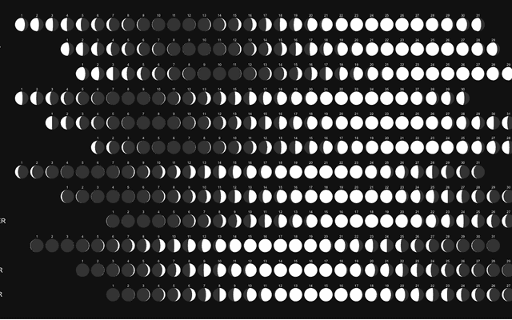</picture><q>Phases of the Moon</q></a>
<a href="/d3/color-schemes"><picture><source srcset="../thumbnail/d3/color-schemes-dark.png" media="(prefers-color-scheme: dark)">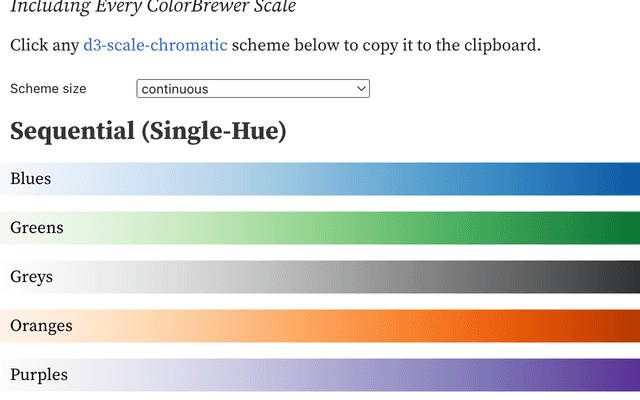</picture><q>Color Schemes</q></a>

