# Pangea Proxima
## Examples, techniques, algorithms: a collection edited by Fil

_What?_ These pages demonstrate some modern data visualization techniques that you
can use on the Web. They are built with [Observable Framework](https://observablehq.com/framework/),
an open-source static site generator for data apps, dashboards, reports, and more.
We mostly use [Observable Plot](https://observablehq.com/plot/) and [D3](https://d3js.org/),
but also venture outside this ecosystem.

_How?_ To access the code of any page, just click on the view source icon ⚉ in the top-right corner. If
you’d like to contribute examples, please open a pull-request on the project’s GitHub [repo](https://github.com/fil/pangea). If you want something that you
don’t find here, please open a [feature request](https://github.com/Fil/pangea/issues/new).

_Who?_ I’m Fil Rivière, I work at [Observable](https://observablehq.com/) with the aim of building a strong foundation
for data visualization on the Web. This is a place where I collect, experiment, showcase, and share some
of the goodies. Most of these pages were initially authored by other people: Mike Bostock, Volodymyr Agafonkin,
Tom McWright, Jason Davies, Allison Horst, Franck Lebeau, Ian Johnson, Shirley Wu, Nadieh Bremer, Jeffrey Heer,
Rene Cutura, Jeff Pettiross, Zan Armstrong, Fabian Iwand, Nicolas Lambert, Cobus Theunissen, Enrico Spinielli,
Harry Stevens, Jareb Wilber, Jean-Daniel Fekete, Dominik Moritz, Kerry Roden, Matteo Abrate, Noah Veltman,
Danilo Di Cuia, John Alexis Guerra Gómez, Justin Kunimune,
and others… thank you to everyone who publishes open source!

<a class="view-source" href="https://github.com/Fil/pangea/blob/main/src/thumbnail/index.md?plain=1">⚉</a>

## Featured

<a href="/plot/voronoi-treemap"><picture><source srcset="../thumbnail/plot/voronoi-treemap-dark.png" media="(prefers-color-scheme: dark)"></picture><q>Voronoi treemap</q></a>
<a href="/party/4-color-clingo"><picture><source srcset="../thumbnail/party/4-color-clingo-dark.png" media="(prefers-color-scheme: dark)"></picture><q>Four-color world map</q></a>
<a href="/d3/chord-diagram"><picture><source srcset="../thumbnail/d3/chord-diagram-dark.png" media="(prefers-color-scheme: dark)"></picture><q>Chord diagram</q></a>
<a href="/plot/ternary"><picture><source srcset="../thumbnail/plot/ternary-dark.png" media="(prefers-color-scheme: dark)"></picture><q>Ternary diagrams</q></a>
<a href="/plot/phases-of-the-moon"><picture><source srcset="../thumbnail/plot/phases-of-the-moon-dark.png" media="(prefers-color-scheme: dark)"></picture><q>Phases of the Moon</q></a>
<a href="/plot/ridgeline"><picture><source srcset="../thumbnail/plot/ridgeline-dark.png" media="(prefers-color-scheme: dark)"></picture><q>Ridgeline plot</q></a>

## Animation

<a href="/d3/animated-treemap"><picture><source srcset="../thumbnail/d3/animated-treemap-dark.png" media="(prefers-color-scheme: dark)">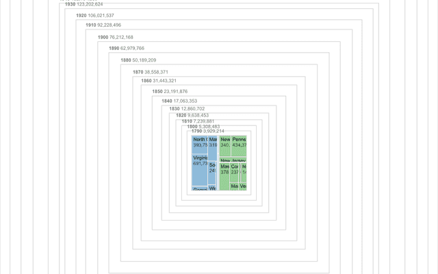</picture><q>Animated treemap</q></a>
<a href="/d3/arc-clock"><picture><source srcset="../thumbnail/d3/arc-clock-dark.png" media="(prefers-color-scheme: dark)"></picture><q>Arc clock</q></a>
<a href="/d3/polar-clock"><picture><source srcset="../thumbnail/d3/polar-clock-dark.png" media="(prefers-color-scheme: dark)"></picture><q>Polar clock</q></a>
<a href="/d3/arc-diagram"><picture><source srcset="../thumbnail/d3/arc-diagram-dark.png" media="(prefers-color-scheme: dark)"></picture><q>Arc diagram</q></a>
<a href="/d3/arc-tween"><picture><source srcset="../thumbnail/d3/arc-tween-dark.png" media="(prefers-color-scheme: dark)"></picture><q>Arc tween</q></a>
<a href="/d3/pie-chart-update"><picture><source srcset="../thumbnail/d3/pie-chart-update-dark.png" media="(prefers-color-scheme: dark)"></picture><q>Pie chart update</q></a>
<a href="/d3/bar-chart-transitions"><picture><source srcset="../thumbnail/d3/bar-chart-transitions-dark.png" media="(prefers-color-scheme: dark)"></picture><q>Bar chart transitions</q></a>
<a href="/d3/bar-chart-race"><picture><source srcset="../thumbnail/d3/bar-chart-race-dark.png" media="(prefers-color-scheme: dark)"></picture><q>Bar chart race</q></a>
<a href="/d3/scatterplot-tour"><picture><source srcset="../thumbnail/d3/scatterplot-tour-dark.png" media="(prefers-color-scheme: dark)"></picture><q>Scatterplot tour</q></a>
<a href="/d3/dot-plot"><picture><source srcset="../thumbnail/d3/dot-plot-dark.png" media="(prefers-color-scheme: dark)"></picture><q>Dot plot</q></a>
<a href="/d3/orthographic-to-equirectangular"><picture><source srcset="../thumbnail/d3/orthographic-to-equirectangular-dark.png" media="(prefers-color-scheme: dark)"></picture><q>Orthographic to equirectangular</q></a>
<a href="/d3/hierarchical-bar-chart"><picture><source srcset="../thumbnail/d3/hierarchical-bar-chart-dark.png" media="(prefers-color-scheme: dark)"></picture><q>Hierarchical bar chart</q></a>
<a href="/d3/stacked-to-grouped-bars"><picture><source srcset="../thumbnail/d3/stacked-to-grouped-bars-dark.png" media="(prefers-color-scheme: dark)"></picture><q>Stacked-to-grouped bars</q></a>
<a href="/d3/temporal-force-directed-graph"><picture><source srcset="../thumbnail/d3/temporal-force-directed-graph-dark.png" media="(prefers-color-scheme: dark)"></picture><q>Temporal force-directed graph</q></a>
<a href="/d3/change-line-chart"><picture><source srcset="../thumbnail/d3/change-line-chart-dark.png" media="(prefers-color-scheme: dark)"></picture><q>Line chart, percent change</q></a>
<a href="/d3/world-tour"><picture><source srcset="../thumbnail/d3/world-tour-dark.png" media="(prefers-color-scheme: dark)"></picture><q>World tour</q></a>
<a href="/plot/index-chart"><picture><source srcset="../thumbnail/plot/index-chart-dark.png" media="(prefers-color-scheme: dark)"></picture><q>Index chart</q></a>
<a href="/d3/connected-scatterplot"><picture><source srcset="../thumbnail/d3/connected-scatterplot-dark.png" media="(prefers-color-scheme: dark)"></picture><q>Connected scatterplot (D3)</q></a>
<a href="/d3/random-tree"><picture><source srcset="../thumbnail/d3/random-tree-dark.png" media="(prefers-color-scheme: dark)"></picture><q>Random Tree</q></a>
<a href="/d3/zoomable-circle-packing"><picture><source srcset="../thumbnail/d3/zoomable-circle-packing-dark.png" media="(prefers-color-scheme: dark)"></picture><q>Zoomable circle packing</q></a>
<a href="/d3/icelandic-population-by-age-1841-2019"><picture><source srcset="../thumbnail/d3/icelandic-population-by-age-1841-2019-dark.png" media="(prefers-color-scheme: dark)"></picture><q>Icelandic population by age, 1841–2019</q></a>
<a href="/d3/streamgraph-transitions"><picture><source srcset="../thumbnail/d3/streamgraph-transitions-dark.png" media="(prefers-color-scheme: dark)"></picture><q>Streamgraph transitions</q></a>
<a href="/d3/smooth-zooming"><picture><source srcset="../thumbnail/d3/smooth-zooming-dark.png" media="(prefers-color-scheme: dark)"></picture><q>Smooth zooming</q></a>
<a href="/d3/zoom-to-bounding-box"><picture><source srcset="../thumbnail/d3/zoom-to-bounding-box-dark.png" media="(prefers-color-scheme: dark)"></picture><q>Zoom to bounding box</q></a>
<a href="/d3/zoomable-bar-chart"><picture><source srcset="../thumbnail/d3/zoomable-bar-chart-dark.png" media="(prefers-color-scheme: dark)">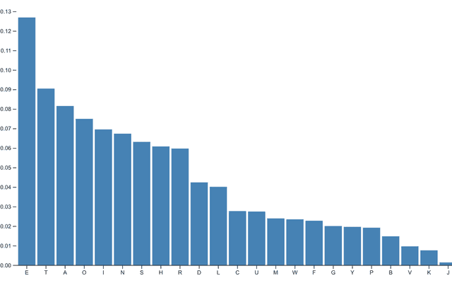</picture><q>Zoomable bar chart</q></a>
<a href="/d3/zoomable-icicle"><picture><source srcset="../thumbnail/d3/zoomable-icicle-dark.png" media="(prefers-color-scheme: dark)"></picture><q>Zoomable icicle</q></a>
<a href="/d3/zoomable-sunburst"><picture><source srcset="../thumbnail/d3/zoomable-sunburst-dark.png" media="(prefers-color-scheme: dark)"></picture><q>Zoomable sunburst</q></a>
<a href="/d3/zoomable-treemap"><picture><source srcset="../thumbnail/d3/zoomable-treemap-dark.png" media="(prefers-color-scheme: dark)"></picture><q>Zoomable treemap</q></a>

## Plot Charts

<a href="/plot/area-chart-gradient"><picture><source srcset="../thumbnail/plot/area-chart-gradient-dark.png" media="(prefers-color-scheme: dark)"></picture><q>Area chart with gradient</q></a>
<a href="/plot/area-chart-missing-data"><picture><source srcset="../thumbnail/plot/area-chart-missing-data-dark.png" media="(prefers-color-scheme: dark)"></picture><q>Area chart, missing data</q></a>
<a href="/plot/area-chart"><picture><source srcset="../thumbnail/plot/area-chart-dark.png" media="(prefers-color-scheme: dark)"></picture><q>Area chart</q></a>
<a href="/plot/arrow-variation-chart"><picture><source srcset="../thumbnail/plot/arrow-variation-chart-dark.png" media="(prefers-color-scheme: dark)"></picture><q>Arrow variation chart</q></a>
<a href="/plot/band-chart-with-rule"><picture><source srcset="../thumbnail/plot/band-chart-with-rule-dark.png" media="(prefers-color-scheme: dark)"></picture><q>Band chart with rule</q></a>
<a href="/plot/barcode"><picture><source srcset="../thumbnail/plot/barcode-dark.png" media="(prefers-color-scheme: dark)"></picture><q>Barcode chart</q></a>
<a href="/plot/candlestick-chart"><picture><source srcset="../thumbnail/plot/candlestick-chart-dark.png" media="(prefers-color-scheme: dark)"></picture><q>Candlestick chart</q></a>
<a href="/plot/difference-chart"><picture><source srcset="../thumbnail/plot/difference-chart-dark.png" media="(prefers-color-scheme: dark)"></picture><q>Difference chart</q></a>
<a href="/plot/grouped-bar-chart"><picture><source srcset="../thumbnail/plot/grouped-bar-chart-dark.png" media="(prefers-color-scheme: dark)"></picture><q>Grouped bar chart</q></a>
<a href="/plot/horizon"><picture><source srcset="../thumbnail/plot/horizon-dark.png" media="(prefers-color-scheme: dark)"></picture><q>Horizon chart</q></a>
<a href="/plot/horizontal-bar-chart-with-label"><picture><source srcset="../thumbnail/plot/horizontal-bar-chart-with-label-dark.png" media="(prefers-color-scheme: dark)"></picture><q>Horizontal bar chart with a label</q></a>
<a href="/plot/horizontal-bar-chart"><picture><source srcset="../thumbnail/plot/horizontal-bar-chart-dark.png" media="(prefers-color-scheme: dark)"></picture><q>Horizontal bar chart</q></a>
<a href="/plot/labeled-multi-line-chart"><picture><source srcset="../thumbnail/plot/labeled-multi-line-chart-dark.png" media="(prefers-color-scheme: dark)"></picture><q>Labeled multi-line chart</q></a>
<a href="/plot/line-chart-interactive-tip"><picture><source srcset="../thumbnail/plot/line-chart-interactive-tip-dark.png" media="(prefers-color-scheme: dark)">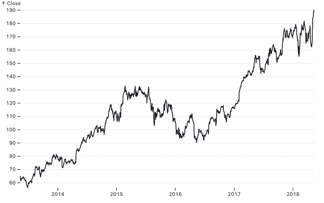</picture><q>Line chart, interactive tip</q></a>
<a href="/plot/line-chart-percent-change"><picture><source srcset="../thumbnail/plot/line-chart-percent-change-dark.png" media="(prefers-color-scheme: dark)"></picture><q>Line chart, percent change</q></a>
<a href="/plot/line-chart-with-markers"><picture><source srcset="../thumbnail/plot/line-chart-with-markers-dark.png" media="(prefers-color-scheme: dark)"></picture><q>Line chart with markers</q></a>
<a href="/plot/multi-series-line-chart-interactive-tips"><picture><source srcset="../thumbnail/plot/multi-series-line-chart-interactive-tips-dark.png" media="(prefers-color-scheme: dark)"></picture><q>Multi-series line chart, interactive tips</q></a>
<a href="/plot/multiple-line-chart"><picture><source srcset="../thumbnail/plot/multiple-line-chart-dark.png" media="(prefers-color-scheme: dark)"></picture><q>Multiple line chart</q></a>
<a href="/plot/non-temporal-line-chart"><picture><source srcset="../thumbnail/plot/non-temporal-line-chart-dark.png" media="(prefers-color-scheme: dark)"></picture><q>Non-temporal line chart</q></a>
<a href="/plot/olympians-grouped-bar-chart"><picture><source srcset="../thumbnail/plot/olympians-grouped-bar-chart-dark.png" media="(prefers-color-scheme: dark)"></picture><q>Olympians grouped bar chart</q></a>
<a href="/plot/ordinal-bar-chart"><picture><source srcset="../thumbnail/plot/ordinal-bar-chart-dark.png" media="(prefers-color-scheme: dark)"></picture><q>Ordinal bar chart</q></a>
<a href="/plot/radar-chart-faceted"><picture><source srcset="../thumbnail/plot/radar-chart-faceted-dark.png" media="(prefers-color-scheme: dark)"></picture><q>Radar chart, small multiples</q></a>
<a href="/plot/radar-chart"><picture><source srcset="../thumbnail/plot/radar-chart-dark.png" media="(prefers-color-scheme: dark)"></picture><q>Radar chart</q></a>
<a href="/plot/ribbon-chart"><picture><source srcset="../thumbnail/plot/ribbon-chart-dark.png" media="(prefers-color-scheme: dark)"></picture><q>Ribbon chart</q></a>
<a href="/plot/simple-line-chart"><picture><source srcset="../thumbnail/plot/simple-line-chart-dark.png" media="(prefers-color-scheme: dark)"></picture><q>Simple line chart</q></a>
<a href="/plot/slope-chart"><picture><source srcset="../thumbnail/plot/slope-chart-dark.png" media="(prefers-color-scheme: dark)"></picture><q>Slope chart</q></a>
<a href="/plot/stacked-area-chart"><picture><source srcset="../thumbnail/plot/stacked-area-chart-dark.png" media="(prefers-color-scheme: dark)"></picture><q>Stacked area chart</q></a>
<a href="/plot/stacked-unit-chart"><picture><source srcset="../thumbnail/plot/stacked-unit-chart-dark.png" media="(prefers-color-scheme: dark)"></picture><q>Stacked unit chart</q></a>
<a href="/plot/temporal-bar-chart"><picture><source srcset="../thumbnail/plot/temporal-bar-chart-dark.png" media="(prefers-color-scheme: dark)"></picture><q>Temporal bar chart</q></a>
<a href="/plot/unemployment-horizon-chart"><picture><source srcset="../thumbnail/plot/unemployment-horizon-chart-dark.png" media="(prefers-color-scheme: dark)"></picture><q>Unemployment horizon chart</q></a>
<a href="/plot/vertical-bar-chart"><picture><source srcset="../thumbnail/plot/vertical-bar-chart-dark.png" media="(prefers-color-scheme: dark)"></picture><q>Vertical bar chart</q></a>
<a href="/plot/binned-box-plot"><picture><source srcset="../thumbnail/plot/binned-box-plot-dark.png" media="(prefers-color-scheme: dark)"></picture><q>Binned box plot</q></a>
<a href="/plot/caltrain-schedule"><picture><source srcset="../thumbnail/plot/caltrain-schedule-dark.png" media="(prefers-color-scheme: dark)"></picture><q>Stem-and-leaf plot</q></a>
<a href="/plot/dot-plot"><picture><source srcset="../thumbnail/plot/dot-plot-dark.png" media="(prefers-color-scheme: dark)"></picture><q>Dot plot</q></a>
<a href="/plot/labelled-horizontal-bar-chart-variants"><picture><source srcset="../thumbnail/plot/labelled-horizontal-bar-chart-variants-dark.png" media="(prefers-color-scheme: dark)"></picture><q>Plot: labelled horizontal bar charts</q></a>
<a href="/plot/plot-of-plots"><picture><source srcset="../thumbnail/plot/plot-of-plots-dark.png" media="(prefers-color-scheme: dark)"></picture><q>Plot of plots</q></a>
<a href="/plot/proportion-plot"><picture><source srcset="../thumbnail/plot/proportion-plot-dark.png" media="(prefers-color-scheme: dark)"></picture><q>Proportion plot</q></a>
<a href="/plot/qq-plot"><picture><source srcset="../thumbnail/plot/qq-plot-dark.png" media="(prefers-color-scheme: dark)"></picture><q>Quantile-quantile plot</q></a>
<a href="/plot/rough-plot"><picture><source srcset="../thumbnail/plot/rough-plot-dark.png" media="(prefers-color-scheme: dark)"></picture><q>Rough Plot</q></a>
<a href="/plot/apportionment-of-seats-in-the-ep"><picture><source srcset="../thumbnail/plot/apportionment-of-seats-in-the-ep-dark.png" media="(prefers-color-scheme: dark)"></picture><q>Apportionment of seats in the European Parliament</q></a>
<a href="/plot/arc-diagram"><picture><source srcset="../thumbnail/plot/arc-diagram-dark.png" media="(prefers-color-scheme: dark)"></picture><q>Arc diagram</q></a>
<a href="/plot/background-image"><picture><source srcset="../thumbnail/plot/background-image-dark.png" media="(prefers-color-scheme: dark)"></picture><q>Background image</q></a>
<a href="/plot/barley-trellis"><picture><source srcset="../thumbnail/plot/barley-trellis-dark.png" media="(prefers-color-scheme: dark)"></picture><q>Barley Trellis</q></a>
<a href="/plot/bollinger-bands"><picture><source srcset="../thumbnail/plot/bollinger-bands-dark.png" media="(prefers-color-scheme: dark)"></picture><q>Bollinger bands</q></a>
<a href="/plot/bullet-graph"><picture><source srcset="../thumbnail/plot/bullet-graph-dark.png" media="(prefers-color-scheme: dark)"></picture><q>Bullet graph</q></a>
<a href="/plot/calendar"><picture><source srcset="../thumbnail/plot/calendar-dark.png" media="(prefers-color-scheme: dark)"></picture><q>Calendar component</q></a>
<a href="/plot/cancer-survival-rates"><picture><source srcset="../thumbnail/plot/cancer-survival-rates-dark.png" media="(prefers-color-scheme: dark)"></picture><q>Cancer survival rates</q></a>
<a href="/plot/civilizations-timeline"><picture><source srcset="../thumbnail/plot/civilizations-timeline-dark.png" media="(prefers-color-scheme: dark)"></picture><q>Civilizations timeline</q></a>
<a href="/plot/cluster-diagram"><picture><source srcset="../thumbnail/plot/cluster-diagram-dark.png" media="(prefers-color-scheme: dark)"></picture><q>Cluster diagram</q></a>
<a href="/plot/correlation-heatmap"><picture><source srcset="../thumbnail/plot/correlation-heatmap-dark.png" media="(prefers-color-scheme: dark)"></picture><q>Correlation heatmap</q></a>
<a href="/plot/cumulative-distribution-of-poverty"><picture><source srcset="../thumbnail/plot/cumulative-distribution-of-poverty-dark.png" media="(prefers-color-scheme: dark)"></picture><q>Cumulative distribution of poverty</q></a>
<a href="/plot/cumulative-histogram"><picture><source srcset="../thumbnail/plot/cumulative-histogram-dark.png" media="(prefers-color-scheme: dark)"></picture><q>Cumulative histogram</q></a>
<a href="/plot/delaunay-hull"><picture><source srcset="../thumbnail/plot/delaunay-hull-dark.png" media="(prefers-color-scheme: dark)"></picture><q>Delaunay & hull</q></a>
<a href="/plot/delaunay-links"><picture><source srcset="../thumbnail/plot/delaunay-links-dark.png" media="(prefers-color-scheme: dark)"></picture><q>Delaunay links</q></a>
<a href="/plot/density-estimation"><picture><source srcset="../thumbnail/plot/density-estimation-dark.png" media="(prefers-color-scheme: dark)"></picture><q>Continuous histogram</q></a>
<a href="/plot/eld-viewer"><picture><source srcset="../thumbnail/plot/eld-viewer-dark.png" media="(prefers-color-scheme: dark)"></picture><q>ELD Viewer</q></a>
<a href="/plot/impact-of-vaccines"><picture><source srcset="../thumbnail/plot/impact-of-vaccines-dark.png" media="(prefers-color-scheme: dark)"></picture><q>The impact of vaccines</q></a>
<a href="/plot/indented-tree"><picture><source srcset="../thumbnail/plot/indented-tree-dark.png" media="(prefers-color-scheme: dark)"></picture><q>Indented tree</q></a>
<a href="/plot/isotype"><picture><source srcset="../thumbnail/plot/isotype-dark.png" media="(prefers-color-scheme: dark)"></picture><q>Isotype</q></a>
<a href="/plot/job-vacancies"><picture><source srcset="../thumbnail/plot/job-vacancies-dark.png" media="(prefers-color-scheme: dark)"></picture><q>Job vacancies</q></a>
<a href="/plot/lebron-james-shots"><picture><source srcset="../thumbnail/plot/lebron-james-shots-dark.png" media="(prefers-color-scheme: dark)"></picture><q>LeBron James’ shots</q></a>
<a href="/plot/tree"><picture><source srcset="../thumbnail/plot/tree-dark.png" media="(prefers-color-scheme: dark)"></picture><q>Tidy tree (Plot)</q></a>
<a href="/plot/trellis-anomaly"><picture><source srcset="../thumbnail/plot/trellis-anomaly-dark.png" media="(prefers-color-scheme: dark)"></picture><q>Barley Trellis plot with arrows</q></a>
<a href="/plot/window-reduce"><picture><source srcset="../thumbnail/plot/window-reduce-dark.png" media="(prefers-color-scheme: dark)"></picture><q>Plot: window reducers</q></a>
<a href="/plot/linear-regression-simpson"><picture><source srcset="../thumbnail/plot/linear-regression-simpson-dark.png" media="(prefers-color-scheme: dark)"></picture><q>Simpson’s paradox</q></a>
<a href="/plot/liquid-flow-velocity"><picture><source srcset="../thumbnail/plot/liquid-flow-velocity-dark.png" media="(prefers-color-scheme: dark)"></picture><q>Liquid flow velocity in pipes</q></a>
<a href="/plot/log-heatmap"><picture><source srcset="../thumbnail/plot/log-heatmap-dark.png" media="(prefers-color-scheme: dark)"></picture><q>Log heatmap</q></a>
<a href="/plot/lollipop"><picture><source srcset="../thumbnail/plot/lollipop-dark.png" media="(prefers-color-scheme: dark)"></picture><q>Lollipop</q></a>

## D3 Charts

<a href="/d3/area-chart-missing-data"><picture><source srcset="../thumbnail/d3/area-chart-missing-data-dark.png" media="(prefers-color-scheme: dark)"></picture><q>Area chart with missing data</q></a>
<a href="/d3/area-chart"><picture><source srcset="../thumbnail/d3/area-chart-dark.png" media="(prefers-color-scheme: dark)"></picture><q>Area chart</q></a>
<a href="/d3/bar-chart"><picture><source srcset="../thumbnail/d3/bar-chart-dark.png" media="(prefers-color-scheme: dark)"></picture><q>Bar chart</q></a>
<a href="/d3/bubble-chart"><picture><source srcset="../thumbnail/d3/bubble-chart-dark.png" media="(prefers-color-scheme: dark)"></picture><q>Bubble chart</q></a>
<a href="/d3/candlestick-chart"><picture><source srcset="../thumbnail/d3/candlestick-chart-dark.png" media="(prefers-color-scheme: dark)"></picture><q>Candlestick chart</q></a>
<a href="/d3/diverging-horizon-chart"><picture><source srcset="../thumbnail/d3/diverging-horizon-chart-dark.png" media="(prefers-color-scheme: dark)">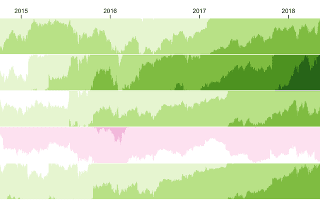</picture><q>Diverging horizon chart</q></a>
<a href="/d3/donut-chart"><picture><source srcset="../thumbnail/d3/donut-chart-dark.png" media="(prefers-color-scheme: dark)"></picture><q>Donut chart</q></a>
<a href="/d3/horizon-chart"><picture><source srcset="../thumbnail/d3/horizon-chart-dark.png" media="(prefers-color-scheme: dark)"></picture><q>Horizon chart</q></a>
<a href="/d3/index-chart"><picture><source srcset="../thumbnail/d3/index-chart-dark.png" media="(prefers-color-scheme: dark)"></picture><q>Index chart</q></a>
<a href="/d3/line-chart"><picture><source srcset="../thumbnail/d3/line-chart-dark.png" media="(prefers-color-scheme: dark)"></picture><q>Line chart</q></a>
<a href="/d3/line-with-tooltip"><picture><source srcset="../thumbnail/d3/line-with-tooltip-dark.png" media="(prefers-color-scheme: dark)"></picture><q>Line chart with tooltip</q></a>
<a href="/d3/multi-line-chart"><picture><source srcset="../thumbnail/d3/multi-line-chart-dark.png" media="(prefers-color-scheme: dark)"></picture><q>Line chart, multiple series</q></a>
<a href="/d3/pie-chart"><picture><source srcset="../thumbnail/d3/pie-chart-dark.png" media="(prefers-color-scheme: dark)"></picture><q>Pie chart</q></a>
<a href="/d3/radial-area-chart"><picture><source srcset="../thumbnail/d3/radial-area-chart-dark.png" media="(prefers-color-scheme: dark)"></picture><q>Radial area chart</q></a>
<a href="/d3/q-q-plot"><picture><source srcset="../thumbnail/d3/q-q-plot-dark.png" media="(prefers-color-scheme: dark)"></picture><q>Q–Q Plot</q></a>
<a href="/d3/ridgeline-plot"><picture><source srcset="../thumbnail/d3/ridgeline-plot-dark.png" media="(prefers-color-scheme: dark)"></picture><q>Ridgeline plot</q></a>
<a href="/d3/brushable-scatterplot-matrix"><picture><source srcset="../thumbnail/d3/brushable-scatterplot-matrix-dark.png" media="(prefers-color-scheme: dark)"></picture><q>Brushable scatterplot matrix</q></a>
<a href="/d3/brushable-scatterplot"><picture><source srcset="../thumbnail/d3/brushable-scatterplot-dark.png" media="(prefers-color-scheme: dark)">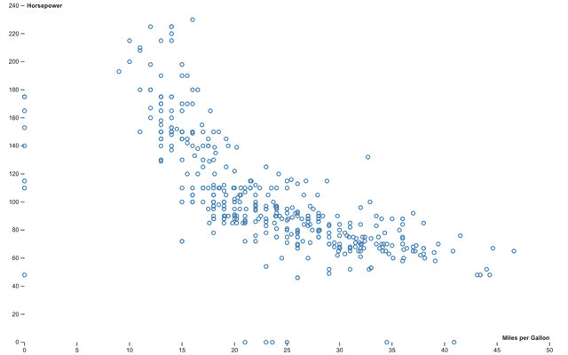</picture><q>Brushable scatterplot</q></a>
<a href="/d3/sequences-sunburst"><picture><source srcset="../thumbnail/d3/sequences-sunburst-dark.png" media="(prefers-color-scheme: dark)"></picture><q>Sequences Sunburst</q></a>
<a href="/d3/burtins-antibiotics"><picture><source srcset="../thumbnail/d3/burtins-antibiotics-dark.png" media="(prefers-color-scheme: dark)"></picture><q>Burtin’s Antibiotics</q></a>
<a href="/d3/cascaded-treemap"><picture><source srcset="../thumbnail/d3/cascaded-treemap-dark.png" media="(prefers-color-scheme: dark)"></picture><q>Cascaded treemap</q></a>
<a href="/d3/chord-dependency-diagram"><picture><source srcset="../thumbnail/d3/chord-dependency-diagram-dark.png" media="(prefers-color-scheme: dark)">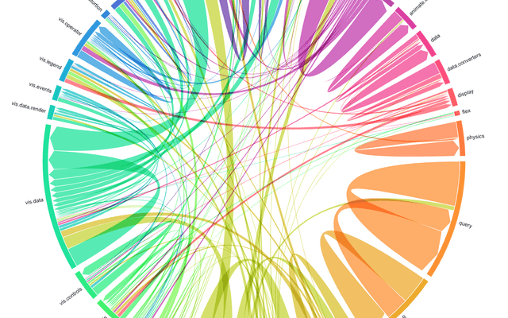</picture><q>Chord dependency diagram</q></a>
<a href="/d3/cluster"><picture><source srcset="../thumbnail/d3/cluster-dark.png" media="(prefers-color-scheme: dark)"></picture><q>Cluster tree</q></a>
<a href="/d3/collapsible-tree"><picture><source srcset="../thumbnail/d3/collapsible-tree-dark.png" media="(prefers-color-scheme: dark)"></picture><q>Collapsible tree</q></a>
<a href="/d3/disjoint-force-directed-graph"><picture><source srcset="../thumbnail/d3/disjoint-force-directed-graph-dark.png" media="(prefers-color-scheme: dark)"></picture><q>Disjoint force-directed graph</q></a>
<a href="/d3/force-directed-graph"><picture><source srcset="../thumbnail/d3/force-directed-graph-dark.png" media="(prefers-color-scheme: dark)"></picture><q>Force-directed graph</q></a>
<a href="/d3/hertzsprung-russell-diagram"><picture><source srcset="../thumbnail/d3/hertzsprung-russell-diagram-dark.png" media="(prefers-color-scheme: dark)"></picture><q>Hertzsprung–Russell diagram</q></a>
<a href="/d3/hierarchical-edge-bundling"><picture><source srcset="../thumbnail/d3/hierarchical-edge-bundling-dark.png" media="(prefers-color-scheme: dark)"></picture><q>Hierarchical edge bundling</q></a>
<a href="/d3/icicle"><picture><source srcset="../thumbnail/d3/icicle-dark.png" media="(prefers-color-scheme: dark)"></picture><q>Icicle</q></a>
<a href="/d3/impact-of-vaccines"><picture><source srcset="../thumbnail/d3/impact-of-vaccines-dark.png" media="(prefers-color-scheme: dark)"></picture><q>The impact of vaccines</q></a>
<a href="/d3/inline-labels"><picture><source srcset="../thumbnail/d3/inline-labels-dark.png" media="(prefers-color-scheme: dark)"></picture><q>Inline labels</q></a>
<a href="/d3/mobile-patent-suits"><picture><source srcset="../thumbnail/d3/mobile-patent-suits-dark.png" media="(prefers-color-scheme: dark)"></picture><q>Mobile patent suits</q></a>
<a href="/d3/moving-average"><picture><source srcset="../thumbnail/d3/moving-average-dark.png" media="(prefers-color-scheme: dark)"></picture><q>Moving average</q></a>
<a href="/d3/nested-treemap"><picture><source srcset="../thumbnail/d3/nested-treemap-dark.png" media="(prefers-color-scheme: dark)"></picture><q>Nested treemap</q></a>
<a href="/d3/new-zealand-tourists-1921-2018"><picture><source srcset="../thumbnail/d3/new-zealand-tourists-1921-2018-dark.png" media="(prefers-color-scheme: dark)"></picture><q>New Zealand tourists, 1921–2018</q></a>
<a href="/d3/pack"><picture><source srcset="../thumbnail/d3/pack-dark.png" media="(prefers-color-scheme: dark)"></picture><q>Circle packing</q></a>
<a href="/d3/psr-b1919-21"><picture><source srcset="../thumbnail/d3/psr-b1919-21-dark.png" media="(prefers-color-scheme: dark)"></picture><q>PSR B1919+21</q></a>
<a href="/d3/radial-cluster"><picture><source srcset="../thumbnail/d3/radial-cluster-dark.png" media="(prefers-color-scheme: dark)"></picture><q>Radial cluster tree</q></a>
<a href="/d3/radial-tree"><picture><source srcset="../thumbnail/d3/radial-tree-dark.png" media="(prefers-color-scheme: dark)"></picture><q>Radial tidy tree</q></a>
<a href="/d3/sankey"><picture><source srcset="../thumbnail/d3/sankey-dark.png" media="(prefers-color-scheme: dark)"></picture><q>Sankey diagram</q></a>
<a href="/d3/splom"><picture><source srcset="../thumbnail/d3/splom-dark.png" media="(prefers-color-scheme: dark)"></picture><q>Scatterplot matrix</q></a>
<a href="/d3/sunburst"><picture><source srcset="../thumbnail/d3/sunburst-dark.png" media="(prefers-color-scheme: dark)"></picture><q>Sunburst</q></a>
<a href="/d3/tree-of-life"><picture><source srcset="../thumbnail/d3/tree-of-life-dark.png" media="(prefers-color-scheme: dark)"></picture><q>Tree of Life</q></a>
<a href="/d3/tree"><picture><source srcset="../thumbnail/d3/tree-dark.png" media="(prefers-color-scheme: dark)"></picture><q>Tidy tree</q></a>
<a href="/d3/treemap"><picture><source srcset="../thumbnail/d3/treemap-dark.png" media="(prefers-color-scheme: dark)"></picture><q>Treemap</q></a>
<a href="/d3/wordcloud"><picture><source srcset="../thumbnail/d3/wordcloud-dark.png" media="(prefers-color-scheme: dark)"></picture><q>Word cloud</q></a>

## Maps & projections

<a href="/d3/clipped-map-tiles"><picture><source srcset="../thumbnail/d3/clipped-map-tiles-dark.png" media="(prefers-color-scheme: dark)"></picture><q>Clipped map tiles</q></a>
<a href="/d3/spilhaus-shoreline-map"><picture><source srcset="../thumbnail/d3/spilhaus-shoreline-map-dark.png" media="(prefers-color-scheme: dark)"></picture><q>Spilhaus shoreline map</q></a>
<a href="/d3/star-map"><picture><source srcset="../thumbnail/d3/star-map-dark.png" media="(prefers-color-scheme: dark)"></picture><q>Star map</q></a>
<a href="/party/deck.gl-map"><picture><source srcset="../thumbnail/party/deck.gl-map-dark.png" media="(prefers-color-scheme: dark)"></picture><q>deck.gl map</q></a>
<a href="/party/plotly"><picture><source srcset="../thumbnail/party/plotly-dark.png" media="(prefers-color-scheme: dark)"></picture><q>Plotly 3D elevation map</q></a>
<a href="/plot/dot-sort"><picture><source srcset="../thumbnail/plot/dot-sort-dark.png" media="(prefers-color-scheme: dark)"></picture><q>Bubble map</q></a>
<a href="/plot/election-wind-map"><picture><source srcset="../thumbnail/plot/election-wind-map-dark.png" media="(prefers-color-scheme: dark)"></picture><q>Election wind map</q></a>
<a href="/plot/hexbin-map"><picture><source srcset="../thumbnail/plot/hexbin-map-dark.png" media="(prefers-color-scheme: dark)"></picture><q>Hexbin map</q></a>
<a href="/plot/map-small-multiples"><picture><source srcset="../thumbnail/plot/map-small-multiples-dark.png" media="(prefers-color-scheme: dark)"></picture><q>Map small multiples</q></a>
<a href="/plot/map-tips"><picture><source srcset="../thumbnail/plot/map-tips-dark.png" media="(prefers-color-scheme: dark)"></picture><q>Map and tips</q></a>
<a href="/plot/us-bubble-map"><picture><source srcset="../thumbnail/plot/us-bubble-map-dark.png" media="(prefers-color-scheme: dark)"></picture><q>U.S. bubble map</q></a>
<a href="/plot/us-spike-map"><picture><source srcset="../thumbnail/plot/us-spike-map-dark.png" media="(prefers-color-scheme: dark)"></picture><q>Spike map</q></a>
<a href="/plot/voronoi-map"><picture><source srcset="../thumbnail/plot/voronoi-map-dark.png" media="(prefers-color-scheme: dark)"></picture><q>Voronoi map</q></a>
<a href="/plot/wind-map"><picture><source srcset="../thumbnail/plot/wind-map-dark.png" media="(prefers-color-scheme: dark)"></picture><q>Wind map</q></a>
<a href="/projections/markley"><picture><source srcset="../thumbnail/projections/markley-dark.png" media="(prefers-color-scheme: dark)"></picture><q>Markley’s tetrahedral map</q></a>
<a href="/plot/county-boxes"><picture><source srcset="../thumbnail/plot/county-boxes-dark.png" media="(prefers-color-scheme: dark)"></picture><q>County boxes</q></a>
<a href="/plot/volcano-raster"><picture><source srcset="../thumbnail/plot/volcano-raster-dark.png" media="(prefers-color-scheme: dark)"></picture><q>Volcano raster</q></a>
<a href="/plot/world-projections"><picture><source srcset="../thumbnail/plot/world-projections-dark.png" media="(prefers-color-scheme: dark)"></picture><q>World projections</q></a>
<a href="/plot/imago-projection"><picture><source srcset="../thumbnail/plot/imago-projection-dark.png" media="(prefers-color-scheme: dark)"></picture><q>Plot: Imago projection</q></a>
<a href="/d3/vector-tiles"><picture><source srcset="../thumbnail/d3/vector-tiles-dark.png" media="(prefers-color-scheme: dark)"></picture><q>D3: Vector tiles</q></a>
<a href="/d3/versor-dragging"><picture><source srcset="../thumbnail/d3/versor-dragging-dark.png" media="(prefers-color-scheme: dark)"></picture><q>Versor dragging</q></a>
<a href="/d3/walmarts-growth-tree"><picture><source srcset="../thumbnail/d3/walmarts-growth-tree-dark.png" media="(prefers-color-scheme: dark)"></picture><q>Walmart’s growth - tree</q></a>
<a href="/d3/walmarts-growth"><picture><source srcset="../thumbnail/d3/walmarts-growth-dark.png" media="(prefers-color-scheme: dark)"></picture><q>Walmart’s growth</q></a>
<a href="/d3/world-airports-voronoi"><picture><source srcset="../thumbnail/d3/world-airports-voronoi-dark.png" media="(prefers-color-scheme: dark)"></picture><q>World airports voronoi</q></a>
<a href="/plot/filled-contours"><picture><source srcset="../thumbnail/plot/filled-contours-dark.png" media="(prefers-color-scheme: dark)"></picture><q>Filled contours</q></a>
<a href="/projections/d3-geo-polygon"><picture><source srcset="../thumbnail/projections/d3-geo-polygon-dark.png" media="(prefers-color-scheme: dark)"></picture><q>d3-geo-polygon</q></a>
<a href="/d3/adaptive-sampling"><picture><source srcset="../thumbnail/d3/adaptive-sampling-dark.png" media="(prefers-color-scheme: dark)"></picture><q>Adaptive sampling</q></a>
<a href="/d3/bivariate-choropleth"><picture><source srcset="../thumbnail/d3/bivariate-choropleth-dark.png" media="(prefers-color-scheme: dark)">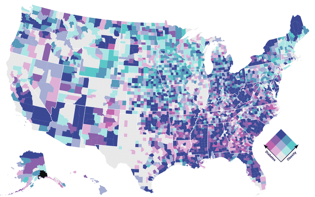</picture><q>Bivariate choropleth</q></a>
<a href="/plot/grid-choropleth"><picture><source srcset="../thumbnail/plot/grid-choropleth-dark.png" media="(prefers-color-scheme: dark)"></picture><q>Grid choropleth</q></a>
<a href="/plot/igrf90-contours"><picture><source srcset="../thumbnail/plot/igrf90-contours-dark.png" media="(prefers-color-scheme: dark)"></picture><q>IGRF90 contours</q></a>
<a href="/d3/choropleth"><picture><source srcset="../thumbnail/d3/choropleth-dark.png" media="(prefers-color-scheme: dark)"></picture><q>Choropleth</q></a>
<a href="/d3/geodesic-rainbow"><picture><source srcset="../thumbnail/d3/geodesic-rainbow-dark.png" media="(prefers-color-scheme: dark)"></picture><q>Geodesic rainbow</q></a>
<a href="/d3/geodesic-voronoi"><picture><source srcset="../thumbnail/d3/geodesic-voronoi-dark.png" media="(prefers-color-scheme: dark)"></picture><q>Geodesic voronoi</q></a>
<a href="/d3/graticule-labels-stereographic"><picture><source srcset="../thumbnail/d3/graticule-labels-stereographic-dark.png" media="(prefers-color-scheme: dark)"></picture><q>Graticule labels (stereographic)</q></a>
<a href="/d3/solar-terminator"><picture><source srcset="../thumbnail/d3/solar-terminator-dark.png" media="(prefers-color-scheme: dark)"></picture><q>Solar Terminator</q></a>
<a href="/d3/spherical-alpha-shapes"><picture><source srcset="../thumbnail/d3/spherical-alpha-shapes-dark.png" media="(prefers-color-scheme: dark)"></picture><q>Spherical alpha shapes</q></a>
<a href="/d3/streaming-shapefiles"><picture><source srcset="../thumbnail/d3/streaming-shapefiles-dark.png" media="(prefers-color-scheme: dark)"></picture><q>Streaming shapefiles</q></a>
<a href="/examples/netcdf"><picture><source srcset="../thumbnail/examples/netcdf-dark.png" media="(prefers-color-scheme: dark)"></picture><q>NetCDF</q></a>
<a href="/party/dobbyscan"><picture><source srcset="../thumbnail/party/dobbyscan-dark.png" media="(prefers-color-scheme: dark)"></picture><q>Hello, dobbyscan</q></a>
<a href="/party/earcut"><picture><source srcset="../thumbnail/party/earcut-dark.png" media="(prefers-color-scheme: dark)"></picture><q>Hello, earcut</q></a>
<a href="/party/geocontour"><picture><source srcset="../thumbnail/party/geocontour-dark.png" media="(prefers-color-scheme: dark)"></picture><q>Spherical contours</q></a>
<a href="/party/geotiff"><picture><source srcset="../thumbnail/party/geotiff-dark.png" media="(prefers-color-scheme: dark)"></picture><q>GeoTIFF contours</q></a>
<a href="/party/geotoolbox"><picture><source srcset="../thumbnail/party/geotoolbox-dark.png" media="(prefers-color-scheme: dark)"></picture><q>Hello, geotoolbox</q></a>
<a href="/plot/earthquake-globe"><picture><source srcset="../thumbnail/plot/earthquake-globe-dark.png" media="(prefers-color-scheme: dark)"></picture><q>Earthquake globe</q></a>
<a href="/plot/floor-plan"><picture><source srcset="../thumbnail/plot/floor-plan-dark.png" media="(prefers-color-scheme: dark)"></picture><q>Floor plan</q></a>
<a href="/plot/london-facets"><picture><source srcset="../thumbnail/plot/london-facets-dark.png" media="(prefers-color-scheme: dark)"></picture><q>London facets</q></a>
<a href="/plot/planar-vs-spherical-voronoi"><picture><source srcset="../thumbnail/plot/planar-vs-spherical-voronoi-dark.png" media="(prefers-color-scheme: dark)"></picture><q>Planar vs. Spherical Voronoi</q></a>
<a href="/plot/polar-projection"><picture><source srcset="../thumbnail/plot/polar-projection-dark.png" media="(prefers-color-scheme: dark)"></picture><q>Polar projection</q></a>
<a href="/plot/projection-domain"><picture><source srcset="../thumbnail/plot/projection-domain-dark.png" media="(prefers-color-scheme: dark)"></picture><q>Projection domain</q></a>
<a href="/plot/raster-projection"><picture><source srcset="../thumbnail/plot/raster-projection-dark.png" media="(prefers-color-scheme: dark)"></picture><q>Projected raster: vapor</q></a>
<a href="/plot/state-centroids"><picture><source srcset="../thumbnail/plot/state-centroids-dark.png" media="(prefers-color-scheme: dark)"></picture><q>State centroids</q></a>
<a href="/plot/state-labels"><picture><source srcset="../thumbnail/plot/state-labels-dark.png" media="(prefers-color-scheme: dark)"></picture><q>State labels</q></a>
<a href="/plot/centroid-dot"><picture><source srcset="../thumbnail/plot/centroid-dot-dark.png" media="(prefers-color-scheme: dark)"></picture><q>Centroid dot</q></a>
<a href="/plot/centroid-hexbin"><picture><source srcset="../thumbnail/plot/centroid-hexbin-dark.png" media="(prefers-color-scheme: dark)"></picture><q>Centroid hexbin</q></a>
<a href="/plot/centroid-voronoi"><picture><source srcset="../thumbnail/plot/centroid-voronoi-dark.png" media="(prefers-color-scheme: dark)"></picture><q>Centroid Voronoi</q></a>
<a href="/plot/choropleth"><picture><source srcset="../thumbnail/plot/choropleth-dark.png" media="(prefers-color-scheme: dark)"></picture><q>Choropleth</q></a>
<a href="/plot/v-counties"><picture><source srcset="../thumbnail/plot/v-counties-dark.png" media="(prefers-color-scheme: dark)"></picture><q>V-Counties</q></a>
<a href="/plot/walmart-density"><picture><source srcset="../thumbnail/plot/walmart-density-dark.png" media="(prefers-color-scheme: dark)"></picture><q>Walmart density</q></a>
<a href="/plot/walmart-voronoi"><picture><source srcset="../thumbnail/plot/walmart-voronoi-dark.png" media="(prefers-color-scheme: dark)"></picture><q>Walmart Voronoi</q></a>
<a href="/party/mosaic-nyc-taxi-rides"><picture><source srcset="../thumbnail/party/mosaic-nyc-taxi-rides-dark.png" media="(prefers-color-scheme: dark)"></picture><q>NYC Taxi Rides</q></a>
<a href="/party/polylabel"><picture><source srcset="../thumbnail/party/polylabel-dark.png" media="(prefers-color-scheme: dark)"></picture><q>Polylabel vs. centroid</q></a>
<a href="/plot/albers-usa"><picture><source srcset="../thumbnail/plot/albers-usa-dark.png" media="(prefers-color-scheme: dark)">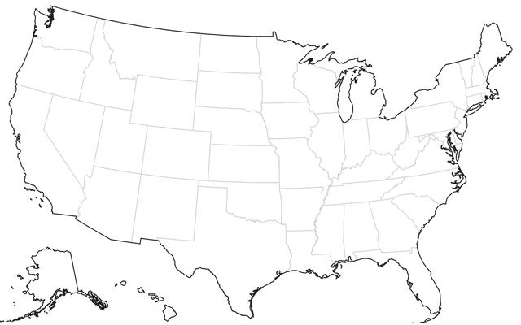</picture><q>Albers-USA projection</q></a>
<a href="/support/mollweide-with-ticks"><picture><source srcset="../thumbnail/support/mollweide-with-ticks-dark.png" media="(prefers-color-scheme: dark)"></picture><q>Mollweide projection with ticks</q></a>
<a href="/projections/himawari-8"><picture><source srcset="../thumbnail/projections/himawari-8-dark.png" media="(prefers-color-scheme: dark)">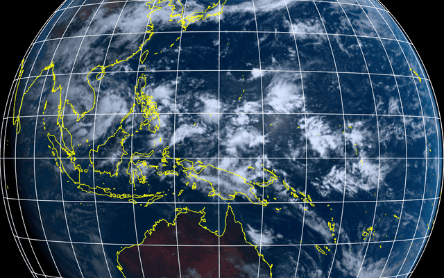</picture><q>Himawari 8</q></a>
<a href="/projections/"><picture><source srcset="../thumbnail/projections/-dark.png" media="(prefers-color-scheme: dark)"></picture><q>Projections</q></a>
<a href="/plot/shockwave"><picture><source srcset="../thumbnail/plot/shockwave-dark.png" media="(prefers-color-scheme: dark)"></picture><q>Shockwave</q></a>
<a href="/plot/interpolate-flood"><picture><source srcset="../thumbnail/plot/interpolate-flood-dark.png" media="(prefers-color-scheme: dark)"></picture><q>Flood spatial interpolator</q></a>
<a href="/projections/renner"><picture><source srcset="../thumbnail/projections/renner-dark.png" media="(prefers-color-scheme: dark)"></picture><q>Renner hemispheric projection</q></a>
<a href="/topojson/country-topology"><picture><source srcset="../thumbnail/topojson/country-topology-dark.png" media="(prefers-color-scheme: dark)"></picture><q>Country Topology</q></a>
<a href="/topojson/county-topology"><picture><source srcset="../thumbnail/topojson/county-topology-dark.png" media="(prefers-color-scheme: dark)"></picture><q>County Topology</q></a>
<a href="/topojson/hexagon-mesh"><picture><source srcset="../thumbnail/topojson/hexagon-mesh-dark.png" media="(prefers-color-scheme: dark)"></picture><q>Hexagon Mesh</q></a>
<a href="/party/maplibre-gl"><picture><source srcset="../thumbnail/party/maplibre-gl-dark.png" media="(prefers-color-scheme: dark)"></picture><q>MapLibre-GL</q></a>
<a href="/d3/non-contiguous-cartogram"><picture><source srcset="../thumbnail/d3/non-contiguous-cartogram-dark.png" media="(prefers-color-scheme: dark)"></picture><q>Non-contiguous cartogram</q></a>
<a href="/plot/beagle-voyage"><picture><source srcset="../thumbnail/plot/beagle-voyage-dark.png" media="(prefers-color-scheme: dark)"></picture><q>Spherical line with a varying stroke</q></a>
<a href="/plot/bivariate-choropleth"><picture><source srcset="../thumbnail/plot/bivariate-choropleth-dark.png" media="(prefers-color-scheme: dark)"></picture><q>Bivariate choropleth</q></a>

## Data analysis

<a href="/party/duckdb"><picture><source srcset="../thumbnail/party/duckdb-dark.png" media="(prefers-color-scheme: dark)"></picture><q>DuckDB</q></a>
<a href="/duckdb/histogram"><picture><source srcset="../thumbnail/duckdb/histogram-dark.png" media="(prefers-color-scheme: dark)"></picture><q>DuckDB histogram</q></a>
<a href="/party/sda"><picture><source srcset="../thumbnail/party/sda-dark.png" media="(prefers-color-scheme: dark)"></picture><q>Simple data analysis</q></a>
<a href="/party/navio"><picture><source srcset="../thumbnail/party/navio-dark.png" media="(prefers-color-scheme: dark)"></picture><q>Navio</q></a>
<a href="/party/mosaic-flights"><picture><source srcset="../thumbnail/party/mosaic-flights-dark.png" media="(prefers-color-scheme: dark)"></picture><q>Mosaic Cross-Filter Flights 10M</q></a>
<a href="/party/ml-matrix"><picture><source srcset="../thumbnail/party/ml-matrix-dark.png" media="(prefers-color-scheme: dark)"></picture><q>Hello, ml-matrix</q></a>
<a href="/party/webr"><picture><source srcset="../thumbnail/party/webr-dark.png" media="(prefers-color-scheme: dark)"></picture><q>WebR</q></a>
<a href="/plot/anscombes-quartet"><picture><source srcset="../thumbnail/plot/anscombes-quartet-dark.png" media="(prefers-color-scheme: dark)"></picture><q>Anscombe’s quartet</q></a>
<a href="/d3/normal-quantile-plot"><picture><source srcset="../thumbnail/d3/normal-quantile-plot-dark.png" media="(prefers-color-scheme: dark)"></picture><q>Normal quantile plot</q></a>
<a href="/party/arrow2parquet"><picture><source srcset="../thumbnail/party/arrow2parquet-dark.png" media="(prefers-color-scheme: dark)"></picture><q>Convert Arrow files to parquet</q></a>
<a href="/party/wikidata"><picture><source srcset="../thumbnail/party/wikidata-dark.png" media="(prefers-color-scheme: dark)"></picture><q>Wikidata</q></a>

## Techniques

<a href="/d3/occlusion"><picture><source srcset="../thumbnail/d3/occlusion-dark.png" media="(prefers-color-scheme: dark)"></picture><q>Occlusion</q></a>
<a href="/d3/voronoi-labels"><picture><source srcset="../thumbnail/d3/voronoi-labels-dark.png" media="(prefers-color-scheme: dark)"></picture><q>D3 Voronoi labels</q></a>
<a href="/d3/voronoi-stippling"><picture><source srcset="../thumbnail/d3/voronoi-stippling-dark.png" media="(prefers-color-scheme: dark)"></picture><q>Voronoi stippling</q></a>
<a href="/party/bitcoin-transaction-size"><picture><source srcset="../thumbnail/party/bitcoin-transaction-size-dark.png" media="(prefers-color-scheme: dark)"></picture><q>WebSocket: Bitcoin transactions</q></a>
<a href="/party/google-sheets"><picture><source srcset="../thumbnail/party/google-sheets-dark.png" media="(prefers-color-scheme: dark)">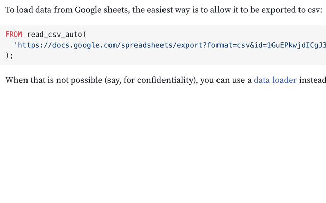</picture><q>Hello, Google sheets</q></a>
<a href="/party/greenlet"><picture><source srcset="../thumbnail/party/greenlet-dark.png" media="(prefers-color-scheme: dark)"></picture><q>Greenlet & workerize</q></a>
<a href="/party/vega-lite-tooltips"><picture><source srcset="../thumbnail/party/vega-lite-tooltips-dark.png" media="(prefers-color-scheme: dark)"></picture><q>Vega lite tooltips</q></a>
<a href="/support/becker-barley-ssr"><picture><source srcset="../thumbnail/support/becker-barley-ssr-dark.png" media="(prefers-color-scheme: dark)"></picture><q>Image data loaders</q></a>
<a href="/support/dark-mode"><picture><source srcset="../thumbnail/support/dark-mode-dark.png" media="(prefers-color-scheme: dark)"></picture><q>Dark mode</q></a>
<a href="/support/debouncing-inputs"><picture><source srcset="../thumbnail/support/debouncing-inputs-dark.png" media="(prefers-color-scheme: dark)"></picture><q>Debouncing inputs</q></a>
<a href="/support/html-inputs"><picture><source srcset="../thumbnail/support/html-inputs-dark.png" media="(prefers-color-scheme: dark)"></picture><q>HTML inputs</q></a>
<a href="/support/inputs-bind"><picture><source srcset="../thumbnail/support/inputs-bind-dark.png" media="(prefers-color-scheme: dark)">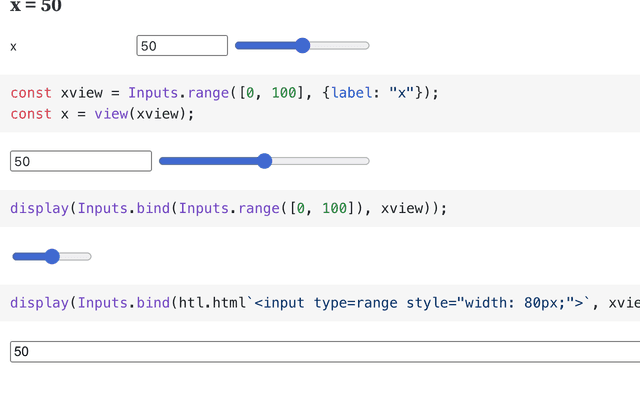</picture><q>Inputs.bind</q></a>
<a href="/support/stored-inputs"><picture><source srcset="../thumbnail/support/stored-inputs-dark.png" media="(prefers-color-scheme: dark)"></picture><q>Stored inputs</q></a>
<a href="/varia/lap-jv"><picture><source srcset="../thumbnail/varia/lap-jv-dark.png" media="(prefers-color-scheme: dark)"></picture><q>The linear assignment problem</q></a>
<a href="/varia/pt"><picture><source srcset="../thumbnail/varia/pt-dark.png" media="(prefers-color-scheme: dark)"></picture><q>pretty-print matrices & tensors</q></a>
<a href="/eurostat"><picture><source srcset="../thumbnail/eurostat-dark.png" media="(prefers-color-scheme: dark)"></picture><q>Eurostat data loaders</q></a>
<a href="/search-graph"><picture><source srcset="../thumbnail/search-graph-dark.png" media="(prefers-color-scheme: dark)"></picture><q>Multi-site search graph</q></a>
<a href="/search"><picture><source srcset="../thumbnail/search-dark.png" media="(prefers-color-scheme: dark)"></picture><q>Multi-site search</q></a>

## and more…

<a href="/d3/bollinger-bands"><picture><source srcset="../thumbnail/d3/bollinger-bands-dark.png" media="(prefers-color-scheme: dark)"></picture><q>Bollinger bands</q></a>
<a href="/d3/box-plot"><picture><source srcset="../thumbnail/d3/box-plot-dark.png" media="(prefers-color-scheme: dark)"></picture><q>Box plot</q></a>
<a href="/d3/density-contours"><picture><source srcset="../thumbnail/d3/density-contours-dark.png" media="(prefers-color-scheme: dark)"></picture><q>Density contours</q></a>
<a href="/d3/directed-chord-diagram"><picture><source srcset="../thumbnail/d3/directed-chord-diagram-dark.png" media="(prefers-color-scheme: dark)"></picture><q>Directed chord diagram</q></a>
<a href="/d3/diverging-bar-chart"><picture><source srcset="../thumbnail/d3/diverging-bar-chart-dark.png" media="(prefers-color-scheme: dark)"></picture><q>Diverging bar chart</q></a>
<a href="/d3/diverging-stacked-bar-chart"><picture><source srcset="../thumbnail/d3/diverging-stacked-bar-chart-dark.png" media="(prefers-color-scheme: dark)"></picture><q>Diverging stacked bar chart</q></a>
<a href="/d3/force-directed-tree"><picture><source srcset="../thumbnail/d3/force-directed-tree-dark.png" media="(prefers-color-scheme: dark)"></picture><q>Force-directed tree</q></a>
<a href="/d3/function-contours"><picture><source srcset="../thumbnail/d3/function-contours-dark.png" media="(prefers-color-scheme: dark)"></picture><q>Function contours</q></a>
<a href="/d3/gradient-encoding"><picture><source srcset="../thumbnail/d3/gradient-encoding-dark.png" media="(prefers-color-scheme: dark)"></picture><q>Gradient encoding</q></a>
<a href="/d3/grouped-bar-chart"><picture><source srcset="../thumbnail/d3/grouped-bar-chart-dark.png" media="(prefers-color-scheme: dark)"></picture><q>Grouped bar chart</q></a>
<a href="/d3/hexbin-area"><picture><source srcset="../thumbnail/d3/hexbin-area-dark.png" media="(prefers-color-scheme: dark)"></picture><q>Hexbin (area)</q></a>
<a href="/d3/hexbin-map"><picture><source srcset="../thumbnail/d3/hexbin-map-dark.png" media="(prefers-color-scheme: dark)"></picture><q>Hexbin map</q></a>
<a href="/d3/hexbin"><picture><source srcset="../thumbnail/d3/hexbin-dark.png" media="(prefers-color-scheme: dark)"></picture><q>Hexbin</q></a>
<a href="/d3/histogram"><picture><source srcset="../thumbnail/d3/histogram-dark.png" media="(prefers-color-scheme: dark)"></picture><q>Histogram</q></a>
<a href="/d3/horizontal-bar-chart"><picture><source srcset="../thumbnail/d3/horizontal-bar-chart-dark.png" media="(prefers-color-scheme: dark)"></picture><q>Horizontal bar chart</q></a>
<a href="/d3/indented-tree"><picture><source srcset="../thumbnail/d3/indented-tree-dark.png" media="(prefers-color-scheme: dark)"></picture><q>Indented tree</q></a>
<a href="/d3/inequality-in-american-cities"><picture><source srcset="../thumbnail/d3/inequality-in-american-cities-dark.png" media="(prefers-color-scheme: dark)"></picture><q>Inequality in American cities</q></a>
<a href="/d3/kernel-density-estimation"><picture><source srcset="../thumbnail/d3/kernel-density-estimation-dark.png" media="(prefers-color-scheme: dark)"></picture><q>Kernel density estimation</q></a>
<a href="/d3/mareys-trains"><picture><source srcset="../thumbnail/d3/mareys-trains-dark.png" media="(prefers-color-scheme: dark)"></picture><q>Marey’s trains</q></a>
<a href="/d3/marimekko"><picture><source srcset="../thumbnail/d3/marimekko-dark.png" media="(prefers-color-scheme: dark)">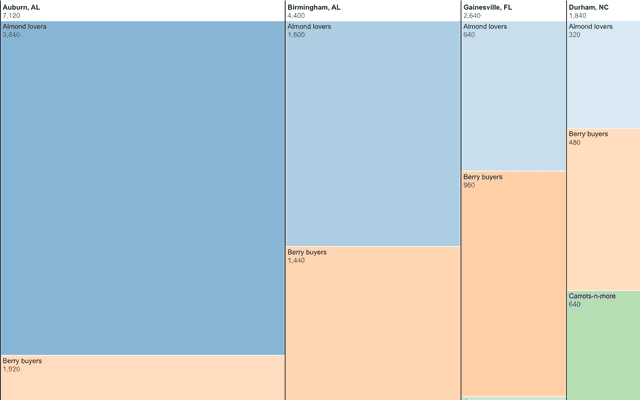</picture><q>Marimekko</q></a>
<a href="/d3/pannable-chart"><picture><source srcset="../thumbnail/d3/pannable-chart-dark.png" media="(prefers-color-scheme: dark)">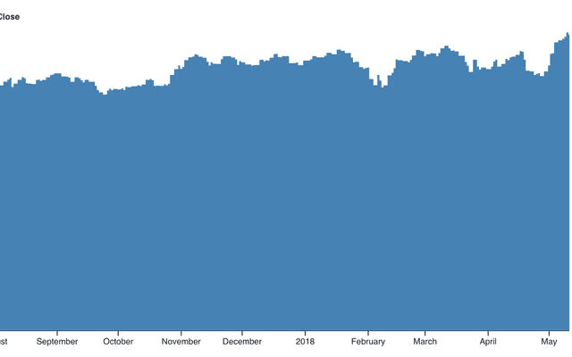</picture><q>Pannable chart</q></a>
<a href="/d3/parallel-coordinates"><picture><source srcset="../thumbnail/d3/parallel-coordinates-dark.png" media="(prefers-color-scheme: dark)"></picture><q>Parallel coordinates</q></a>
<a href="/d3/parallel-sets"><picture><source srcset="../thumbnail/d3/parallel-sets-dark.png" media="(prefers-color-scheme: dark)"></picture><q>Parallel sets</q></a>
<a href="/d3/projection-comparison"><picture><source srcset="../thumbnail/d3/projection-comparison-dark.png" media="(prefers-color-scheme: dark)"></picture><q>Projection comparison</q></a>
<a href="/d3/radial-stacked-bar-chart"><picture><source srcset="../thumbnail/d3/radial-stacked-bar-chart-dark.png" media="(prefers-color-scheme: dark)"></picture><q>Radial stacked bar chart</q></a>
<a href="/d3/seamless-zoomable-map-tiles"><picture><source srcset="../thumbnail/d3/seamless-zoomable-map-tiles-dark.png" media="(prefers-color-scheme: dark)"></picture><q>Seamless zoomable map tiles</q></a>
<a href="/d3/solar-path"><picture><source srcset="../thumbnail/d3/solar-path-dark.png" media="(prefers-color-scheme: dark)"></picture><q>Solar path</q></a>
<a href="/d3/stacked-bar-chart"><picture><source srcset="../thumbnail/d3/stacked-bar-chart-dark.png" media="(prefers-color-scheme: dark)"></picture><q>Stacked bar chart</q></a>
<a href="/d3/stacked-horizontal-bar-chart"><picture><source srcset="../thumbnail/d3/stacked-horizontal-bar-chart-dark.png" media="(prefers-color-scheme: dark)"></picture><q>Stacked bar chart, horizontal</q></a>
<a href="/d3/stacked-normalized-horizontal-bar"><picture><source srcset="../thumbnail/d3/stacked-normalized-horizontal-bar-dark.png" media="(prefers-color-scheme: dark)"></picture><q>Stacked bar chart, normalized</q></a>
<a href="/d3/tangled-tree"><picture><source srcset="../thumbnail/d3/tangled-tree-dark.png" media="(prefers-color-scheme: dark)"></picture><q>Tangled tree</q></a>
<a href="/d3/the-wealth-health-of-nations"><picture><source srcset="../thumbnail/d3/the-wealth-health-of-nations-dark.png" media="(prefers-color-scheme: dark)"></picture><q>The Wealth & Health of Nations</q></a>
<a href="/d3/threshold-encoding"><picture><source srcset="../thumbnail/d3/threshold-encoding-dark.png" media="(prefers-color-scheme: dark)"></picture><q>Threshold encoding</q></a>
<a href="/d3/variable-color-line"><picture><source srcset="../thumbnail/d3/variable-color-line-dark.png" media="(prefers-color-scheme: dark)"></picture><q>Variable-color line</q></a>
<a href="/d3/vector-field"><picture><source srcset="../thumbnail/d3/vector-field-dark.png" media="(prefers-color-scheme: dark)"></picture><q>Vector field</q></a>
<a href="/d3/volcano-contours"><picture><source srcset="../thumbnail/d3/volcano-contours-dark.png" media="(prefers-color-scheme: dark)"></picture><q>Volcano contours</q></a>
<a href="/d3/watercolor"><picture><source srcset="../thumbnail/d3/watercolor-dark.png" media="(prefers-color-scheme: dark)"></picture><q>Watercolor</q></a>
<a href="/d3/world-history-timeline"><picture><source srcset="../thumbnail/d3/world-history-timeline-dark.png" media="(prefers-color-scheme: dark)"></picture><q>World history timeline</q></a>
<a href="/d3/zoomable-area-chart"><picture><source srcset="../thumbnail/d3/zoomable-area-chart-dark.png" media="(prefers-color-scheme: dark)"></picture><q>Zoomable area chart</q></a>
<a href="/loaders/email-timestamps"><picture><source srcset="../thumbnail/loaders/email-timestamps-dark.png" media="(prefers-color-scheme: dark)"></picture><q>email timestamps</q></a>
<a href="/loaders/google-sheets"><picture><source srcset="../thumbnail/loaders/google-sheets-dark.png" media="(prefers-color-scheme: dark)">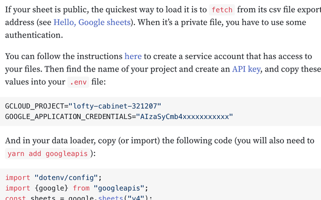</picture><q>Google Sheets data loader</q></a>
<a href="/loaders/greek-youth"><picture><source srcset="../thumbnail/loaders/greek-youth-dark.png" media="(prefers-color-scheme: dark)"></picture><q>Greek youth</q></a>
<a href="/party/blue-comments"><picture><source srcset="../thumbnail/party/blue-comments-dark.png" media="(prefers-color-scheme: dark)"></picture><q>Bluesky comments</q></a>
<a href="/party/deck.gl"><picture><source srcset="../thumbnail/party/deck.gl-dark.png" media="(prefers-color-scheme: dark)"></picture><q>deck.gl point cloud</q></a>
<a href="/party/graphviz-connected-clusters"><picture><source srcset="../thumbnail/party/graphviz-connected-clusters-dark.png" media="(prefers-color-scheme: dark)">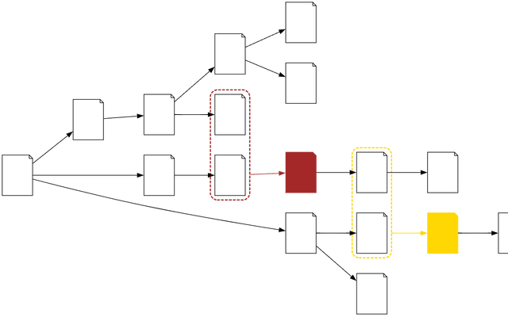</picture><q>Graphviz - connected clusters</q></a>
<a href="/party/highcharts"><picture><source srcset="../thumbnail/party/highcharts-dark.png" media="(prefers-color-scheme: dark)"></picture><q>Highcharts</q></a>
<a href="/party/hljs"><picture><source srcset="../thumbnail/party/hljs-dark.png" media="(prefers-color-scheme: dark)"></picture><q>Display code with hljs</q></a>
<a href="/party/hyparquet"><picture><source srcset="../thumbnail/party/hyparquet-dark.png" media="(prefers-color-scheme: dark)"></picture><q>hyparquet</q></a>
<a href="/party/interactive-jsx"><picture><source srcset="../thumbnail/party/interactive-jsx-dark.png" media="(prefers-color-scheme: dark)"></picture><q>Interactive JSX</q></a>
<a href="/party/jszip"><picture><source srcset="../thumbnail/party/jszip-dark.png" media="(prefers-color-scheme: dark)"></picture><q>Hello, jszip</q></a>
<a href="/party/mandelbrot"><picture><source srcset="../thumbnail/party/mandelbrot-dark.png" media="(prefers-color-scheme: dark)">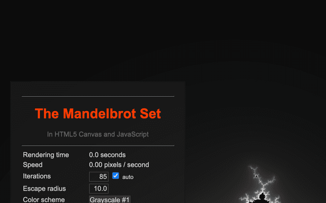</picture><q>The Mandelbrot Set in HTML5 Canvas & JavaScript</q></a>
<a href="/party/markdown-it"><picture><source srcset="../thumbnail/party/markdown-it-dark.png" media="(prefers-color-scheme: dark)"></picture><q>Markdown-it</q></a>
<a href="/party/mhchem"><picture><source srcset="../thumbnail/party/mhchem-dark.png" media="(prefers-color-scheme: dark)"></picture><q>Chemistry notation using mhchem</q></a>
<a href="/party/p5"><picture><source srcset="../thumbnail/party/p5-dark.png" media="(prefers-color-scheme: dark)"></picture><q>p5.js</q></a>
<a href="/party/roughviz"><picture><source srcset="../thumbnail/party/roughviz-dark.png" media="(prefers-color-scheme: dark)"></picture><q>RoughViz</q></a>
<a href="/party/surge"><picture><source srcset="../thumbnail/party/surge-dark.png" media="(prefers-color-scheme: dark)"></picture><q>surge.sh hosting</q></a>
<a href="/party/three"><picture><source srcset="../thumbnail/party/three-dark.png" media="(prefers-color-scheme: dark)"></picture><q>Three</q></a>
<a href="/plot/arealiney-custom-mark"><picture><source srcset="../thumbnail/plot/arealiney-custom-mark-dark.png" media="(prefers-color-scheme: dark)"></picture><q>arealineY custom mark</q></a>
<a href="/plot/auto-mark-heatmap"><picture><source srcset="../thumbnail/plot/auto-mark-heatmap-dark.png" media="(prefers-color-scheme: dark)"></picture><q>Auto mark, heatmap</q></a>
<a href="/plot/bar-and-tick"><picture><source srcset="../thumbnail/plot/bar-and-tick-dark.png" media="(prefers-color-scheme: dark)"></picture><q>Bar and tick</q></a>
<a href="/plot/blurred-contours"><picture><source srcset="../thumbnail/plot/blurred-contours-dark.png" media="(prefers-color-scheme: dark)"></picture><q>Blurred contours</q></a>
<a href="/plot/color-crosshair"><picture><source srcset="../thumbnail/plot/color-crosshair-dark.png" media="(prefers-color-scheme: dark)"></picture><q>Color crosshair</q></a>
<a href="/plot/color-scatterplot"><picture><source srcset="../thumbnail/plot/color-scatterplot-dark.png" media="(prefers-color-scheme: dark)"></picture><q>Scatterplot with color</q></a>
<a href="/plot/connected-scatterplot"><picture><source srcset="../thumbnail/plot/connected-scatterplot-dark.png" media="(prefers-color-scheme: dark)"></picture><q>Connected scatterplot</q></a>
<a href="/plot/continuous-dimensions-heatmap"><picture><source srcset="../thumbnail/plot/continuous-dimensions-heatmap-dark.png" media="(prefers-color-scheme: dark)"></picture><q>Quantitative dimensions heatmap</q></a>
<a href="/plot/contours-projection"><picture><source srcset="../thumbnail/plot/contours-projection-dark.png" media="(prefers-color-scheme: dark)"></picture><q>Contours & projection</q></a>
<a href="/plot/crimean-war-bary"><picture><source srcset="../thumbnail/plot/crimean-war-bary-dark.png" media="(prefers-color-scheme: dark)"></picture><q>Crimean war casualties by cause (bar)</q></a>
<a href="/plot/crimean-war-recty"><picture><source srcset="../thumbnail/plot/crimean-war-recty-dark.png" media="(prefers-color-scheme: dark)"></picture><q>Crimean war casualties by cause (rect)</q></a>
<a href="/plot/crosshair"><picture><source srcset="../thumbnail/plot/crosshair-dark.png" media="(prefers-color-scheme: dark)"></picture><q>Crosshair</q></a>
<a href="/plot/crosshairx"><picture><source srcset="../thumbnail/plot/crosshairx-dark.png" media="(prefers-color-scheme: dark)"></picture><q>CrosshairX</q></a>
<a href="/plot/data-based-axis"><picture><source srcset="../thumbnail/plot/data-based-axis-dark.png" media="(prefers-color-scheme: dark)"></picture><q>Data-based axis</q></a>
<a href="/plot/datawrapper-style-date-axis"><picture><source srcset="../thumbnail/plot/datawrapper-style-date-axis-dark.png" media="(prefers-color-scheme: dark)"></picture><q>Datawrapper-style date axis</q></a>
<a href="/plot/density-faceted"><picture><source srcset="../thumbnail/plot/density-faceted-dark.png" media="(prefers-color-scheme: dark)"></picture><q>Density, faceted</q></a>
<a href="/plot/density-options"><picture><source srcset="../thumbnail/plot/density-options-dark.png" media="(prefers-color-scheme: dark)"></picture><q>Density options</q></a>
<a href="/plot/density-stroke"><picture><source srcset="../thumbnail/plot/density-stroke-dark.png" media="(prefers-color-scheme: dark)"></picture><q>Density stroke</q></a>
<a href="/plot/density-weighted"><picture><source srcset="../thumbnail/plot/density-weighted-dark.png" media="(prefers-color-scheme: dark)"></picture><q>Density skew (weight) interactive</q></a>
<a href="/plot/difference-arrows"><picture><source srcset="../thumbnail/plot/difference-arrows-dark.png" media="(prefers-color-scheme: dark)"></picture><q>Difference arrows</q></a>
<a href="/plot/diverging-color-scatterplot"><picture><source srcset="../thumbnail/plot/diverging-color-scatterplot-dark.png" media="(prefers-color-scheme: dark)"></picture><q>Diverging color scatterplot</q></a>
<a href="/plot/diverging-stacked-bar"><picture><source srcset="../thumbnail/plot/diverging-stacked-bar-dark.png" media="(prefers-color-scheme: dark)"></picture><q>Diverging stacked bars</q></a>
<a href="/plot/dodge-cars"><picture><source srcset="../thumbnail/plot/dodge-cars-dark.png" media="(prefers-color-scheme: dark)"></picture><q>Dodge cars (beeswarm)</q></a>
<a href="/plot/dodge-penguins"><picture><source srcset="../thumbnail/plot/dodge-penguins-dark.png" media="(prefers-color-scheme: dark)"></picture><q>Dodge penguins</q></a>
<a href="/plot/dot-heatmap"><picture><source srcset="../thumbnail/plot/dot-heatmap-dark.png" media="(prefers-color-scheme: dark)"></picture><q>Dot heatmap</q></a>
<a href="/plot/dot-histogram"><picture><source srcset="../thumbnail/plot/dot-histogram-dark.png" media="(prefers-color-scheme: dark)"></picture><q>Dot histogram</q></a>
<a href="/plot/dow-jones-calendar"><picture><source srcset="../thumbnail/plot/dow-jones-calendar-dark.png" media="(prefers-color-scheme: dark)"></picture><q>Simple calendar</q></a>
<a href="/plot/facet-lollipop"><picture><source srcset="../thumbnail/plot/facet-lollipop-dark.png" media="(prefers-color-scheme: dark)"></picture><q>Small multiple lollipop</q></a>
<a href="/plot/facet-wrap"><picture><source srcset="../thumbnail/plot/facet-wrap-dark.png" media="(prefers-color-scheme: dark)"></picture><q>Facet wrap</q></a>
<a href="/plot/faceted-areas"><picture><source srcset="../thumbnail/plot/faceted-areas-dark.png" media="(prefers-color-scheme: dark)"></picture><q>Faceted areas</q></a>
<a href="/plot/faceted-function-contour"><picture><source srcset="../thumbnail/plot/faceted-function-contour-dark.png" media="(prefers-color-scheme: dark)"></picture><q>Faceted function contour</q></a>
<a href="/plot/finite-state-machine"><picture><source srcset="../thumbnail/plot/finite-state-machine-dark.png" media="(prefers-color-scheme: dark)"></picture><q>Finite state machine</q></a>
<a href="/plot/function-contour-2"><picture><source srcset="../thumbnail/plot/function-contour-2-dark.png" media="(prefers-color-scheme: dark)"></picture><q>Function contour 2</q></a>
<a href="/plot/function-contour"><picture><source srcset="../thumbnail/plot/function-contour-dark.png" media="(prefers-color-scheme: dark)"></picture><q>Function contour</q></a>
<a href="/plot/ggplot2-style-axes"><picture><source srcset="../thumbnail/plot/ggplot2-style-axes-dark.png" media="(prefers-color-scheme: dark)"></picture><q>ggplot2-style axes</q></a>
<a href="/plot/gradient-bars"><picture><source srcset="../thumbnail/plot/gradient-bars-dark.png" media="(prefers-color-scheme: dark)"></picture><q>Gradient bars</q></a>
<a href="/plot/gradient-encoding"><picture><source srcset="../thumbnail/plot/gradient-encoding-dark.png" media="(prefers-color-scheme: dark)"></picture><q>Gradient encoding</q></a>
<a href="/plot/hexbin-binwidth"><picture><source srcset="../thumbnail/plot/hexbin-binwidth-dark.png" media="(prefers-color-scheme: dark)"></picture><q>Hexbin binWidth option</q></a>
<a href="/plot/hexbin-text"><picture><source srcset="../thumbnail/plot/hexbin-text-dark.png" media="(prefers-color-scheme: dark)"></picture><q>Hexbin text</q></a>
<a href="/plot/highlighted-bin"><picture><source srcset="../thumbnail/plot/highlighted-bin-dark.png" media="(prefers-color-scheme: dark)"></picture><q>Highlighted bin</q></a>
<a href="/plot/horizontal-stacked-bars"><picture><source srcset="../thumbnail/plot/horizontal-stacked-bars-dark.png" media="(prefers-color-scheme: dark)"></picture><q>Horizontal stacked bars</q></a>
<a href="/plot/image-dodge"><picture><source srcset="../thumbnail/plot/image-dodge-dark.png" media="(prefers-color-scheme: dark)"></picture><q>Image beeswarm (dodge)</q></a>
<a href="/plot/image-medals"><picture><source srcset="../thumbnail/plot/image-medals-dark.png" media="(prefers-color-scheme: dark)"></picture><q>Image medals</q></a>
<a href="/plot/image-scatterplot-2"><picture><source srcset="../thumbnail/plot/image-scatterplot-2-dark.png" media="(prefers-color-scheme: dark)"></picture><q>Default image scatterplot</q></a>
<a href="/plot/image-scatterplot"><picture><source srcset="../thumbnail/plot/image-scatterplot-dark.png" media="(prefers-color-scheme: dark)"></picture><q>Image scatterplot</q></a>
<a href="/plot/line-chart-with-gaps"><picture><source srcset="../thumbnail/plot/line-chart-with-gaps-dark.png" media="(prefers-color-scheme: dark)"></picture><q>Line with missing data</q></a>
<a href="/plot/line-with-moving-average"><picture><source srcset="../thumbnail/plot/line-with-moving-average-dark.png" media="(prefers-color-scheme: dark)"></picture><q>Line with moving average</q></a>
<a href="/plot/major-and-minor-axis-ticks"><picture><source srcset="../thumbnail/plot/major-and-minor-axis-ticks-dark.png" media="(prefers-color-scheme: dark)"></picture><q>Major and minor axis ticks</q></a>
<a href="/plot/mandelbrot-set"><picture><source srcset="../thumbnail/plot/mandelbrot-set-dark.png" media="(prefers-color-scheme: dark)"></picture><q>Mandelbrot set</q></a>
<a href="/plot/mareys-trains"><picture><source srcset="../thumbnail/plot/mareys-trains-dark.png" media="(prefers-color-scheme: dark)"></picture><q>Marey’s trains</q></a>
<a href="/plot/marimekko"><picture><source srcset="../thumbnail/plot/marimekko-dark.png" media="(prefers-color-scheme: dark)"></picture><q>Marimekko</q></a>
<a href="/plot/non-faceted-marks"><picture><source srcset="../thumbnail/plot/non-faceted-marks-dark.png" media="(prefers-color-scheme: dark)"></picture><q>Non-faceted marks</q></a>
<a href="/plot/non-overlapping-density-regions"><picture><source srcset="../thumbnail/plot/non-overlapping-density-regions-dark.png" media="(prefers-color-scheme: dark)"></picture><q>Non-overlapping density regions</q></a>
<a href="/plot/normal-histogram"><picture><source srcset="../thumbnail/plot/normal-histogram-dark.png" media="(prefers-color-scheme: dark)"></picture><q>Normal histogram</q></a>
<a href="/plot/normalized-stack"><picture><source srcset="../thumbnail/plot/normalized-stack-dark.png" media="(prefers-color-scheme: dark)"></picture><q>Normalized stack</q></a>
<a href="/plot/nyt-style-axes"><picture><source srcset="../thumbnail/plot/nyt-style-axes-dark.png" media="(prefers-color-scheme: dark)"></picture><q>New York Times-style axes</q></a>
<a href="/plot/olympians-density"><picture><source srcset="../thumbnail/plot/olympians-density-dark.png" media="(prefers-color-scheme: dark)"></picture><q>Olympians density</q></a>
<a href="/plot/olympians-hexbin"><picture><source srcset="../thumbnail/plot/olympians-hexbin-dark.png" media="(prefers-color-scheme: dark)"></picture><q>Hexbin heatmap</q></a>
<a href="/plot/one-dimensional-crosshair"><picture><source srcset="../thumbnail/plot/one-dimensional-crosshair-dark.png" media="(prefers-color-scheme: dark)"></picture><q>One-dimensional crosshair</q></a>
<a href="/plot/one-dimensional-density"><picture><source srcset="../thumbnail/plot/one-dimensional-density-dark.png" media="(prefers-color-scheme: dark)"></picture><q>One-dimensional density</q></a>
<a href="/plot/one-dimensional-pointing"><picture><source srcset="../thumbnail/plot/one-dimensional-pointing-dark.png" media="(prefers-color-scheme: dark)"></picture><q>One-dimensional pointing</q></a>
<a href="/plot/ordinal-scale-interval"><picture><source srcset="../thumbnail/plot/ordinal-scale-interval-dark.png" media="(prefers-color-scheme: dark)">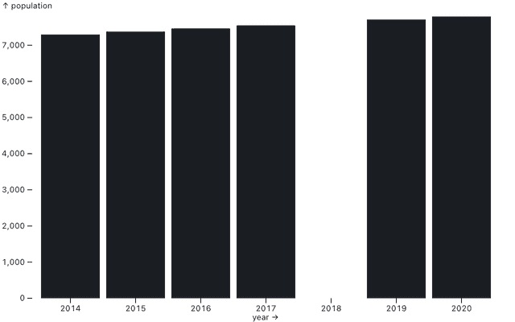</picture><q>Ordinal scale interval</q></a>
<a href="/plot/ordinal-scatterplot"><picture><source srcset="../thumbnail/plot/ordinal-scatterplot-dark.png" media="(prefers-color-scheme: dark)"></picture><q>Ordinal scatterplot</q></a>
<a href="/plot/overlapping-density-estimations"><picture><source srcset="../thumbnail/plot/overlapping-density-estimations-dark.png" media="(prefers-color-scheme: dark)"></picture><q>Overlapping density estimations</q></a>
<a href="/plot/overlapping-histogram"><picture><source srcset="../thumbnail/plot/overlapping-histogram-dark.png" media="(prefers-color-scheme: dark)"></picture><q>Overlapping histogram</q></a>
<a href="/plot/parcoords"><picture><source srcset="../thumbnail/plot/parcoords-dark.png" media="(prefers-color-scheme: dark)"></picture><q>Parallel coordinates</q></a>
<a href="/plot/percentogram"><picture><source srcset="../thumbnail/plot/percentogram-dark.png" media="(prefers-color-scheme: dark)"></picture><q>Percentogram</q></a>
<a href="/plot/perlin-noise"><picture><source srcset="../thumbnail/plot/perlin-noise-dark.png" media="(prefers-color-scheme: dark)"></picture><q>Perlin noise</q></a>
<a href="/plot/point-cloud-density"><picture><source srcset="../thumbnail/plot/point-cloud-density-dark.png" media="(prefers-color-scheme: dark)"></picture><q>Point cloud density</q></a>
<a href="/plot/pointer-modes-x-y-and-xy"><picture><source srcset="../thumbnail/plot/pointer-modes-x-y-and-xy-dark.png" media="(prefers-color-scheme: dark)"></picture><q>Pointer modes (x, y, and xy)</q></a>
<a href="/plot/pointer-target-position"><picture><source srcset="../thumbnail/plot/pointer-target-position-dark.png" media="(prefers-color-scheme: dark)"></picture><q>Pointer target position</q></a>
<a href="/plot/pointer-transform"><picture><source srcset="../thumbnail/plot/pointer-transform-dark.png" media="(prefers-color-scheme: dark)"></picture><q>Pointer transform</q></a>
<a href="/plot/polylinear-axis"><picture><source srcset="../thumbnail/plot/polylinear-axis-dark.png" media="(prefers-color-scheme: dark)"></picture><q>Polylinear axis</q></a>
<a href="/plot/population-pyramid"><picture><source srcset="../thumbnail/plot/population-pyramid-dark.png" media="(prefers-color-scheme: dark)"></picture><q>Population pyramid</q></a>
<a href="/plot/prebinned-histogram"><picture><source srcset="../thumbnail/plot/prebinned-histogram-dark.png" media="(prefers-color-scheme: dark)"></picture><q>Pre-binned histogram</q></a>
<a href="/plot/proportional-symbol-scatterplot"><picture><source srcset="../thumbnail/plot/proportional-symbol-scatterplot-dark.png" media="(prefers-color-scheme: dark)"></picture><q>Proportional symbol scatterplot</q></a>
<a href="/plot/psr-b1919-21"><picture><source srcset="../thumbnail/plot/psr-b1919-21-dark.png" media="(prefers-color-scheme: dark)"></picture><q>PSR B1919+21</q></a>
<a href="/plot/random-walk"><picture><source srcset="../thumbnail/plot/random-walk-dark.png" media="(prefers-color-scheme: dark)"></picture><q>Random walk</q></a>
<a href="/plot/scatterplot-with-interactive-tips"><picture><source srcset="../thumbnail/plot/scatterplot-with-interactive-tips-dark.png" media="(prefers-color-scheme: dark)"></picture><q>Scatterplot with interactive tips</q></a>
<a href="/plot/scatterplot-with-ordinal-dimension"><picture><source srcset="../thumbnail/plot/scatterplot-with-ordinal-dimension-dark.png" media="(prefers-color-scheme: dark)"></picture><q>Scatterplot with ordinal dimension</q></a>
<a href="/plot/scatterplot"><picture><source srcset="../thumbnail/plot/scatterplot-dark.png" media="(prefers-color-scheme: dark)"></picture><q>Scatterplot</q></a>
<a href="/plot/seattle-temperature-heatmap"><picture><source srcset="../thumbnail/plot/seattle-temperature-heatmap-dark.png" media="(prefers-color-scheme: dark)"></picture><q>Seattle temperature temporal heatmap</q></a>
<a href="/plot/simpsons-ratings"><picture><source srcset="../thumbnail/plot/simpsons-ratings-dark.png" media="(prefers-color-scheme: dark)"></picture><q>Simpsons ratings</q></a>
<a href="/plot/single-stacked-bar"><picture><source srcset="../thumbnail/plot/single-stacked-bar-dark.png" media="(prefers-color-scheme: dark)"></picture><q>Single stacked bar</q></a>
<a href="/plot/small-grid-contours"><picture><source srcset="../thumbnail/plot/small-grid-contours-dark.png" media="(prefers-color-scheme: dark)"></picture><q>Small grid contours</q></a>
<a href="/plot/sorted-groups"><picture><source srcset="../thumbnail/plot/sorted-groups-dark.png" media="(prefers-color-scheme: dark)">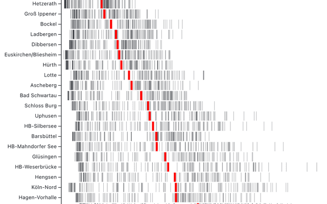</picture><q>Germany traffic patterns</q></a>
<a href="/plot/sorted-heatmap"><picture><source srcset="../thumbnail/plot/sorted-heatmap-dark.png" media="(prefers-color-scheme: dark)"></picture><q>Sorted heatmap</q></a>
<a href="/plot/spiral-heatmap"><picture><source srcset="../thumbnail/plot/spiral-heatmap-dark.png" media="(prefers-color-scheme: dark)"></picture><q>Spiral heatmap</q></a>
<a href="/plot/stacked-bars"><picture><source srcset="../thumbnail/plot/stacked-bars-dark.png" media="(prefers-color-scheme: dark)"></picture><q>Stacked bars</q></a>
<a href="/plot/stacked-dots"><picture><source srcset="../thumbnail/plot/stacked-dots-dark.png" media="(prefers-color-scheme: dark)"></picture><q>Stacked dots</q></a>
<a href="/plot/stacked-histogram"><picture><source srcset="../thumbnail/plot/stacked-histogram-dark.png" media="(prefers-color-scheme: dark)"></picture><q>Stacked histogram</q></a>
<a href="/plot/stacked-percentages"><picture><source srcset="../thumbnail/plot/stacked-percentages-dark.png" media="(prefers-color-scheme: dark)"></picture><q>Stacked percentages</q></a>
<a href="/plot/stacking-order-and-reverse"><picture><source srcset="../thumbnail/plot/stacking-order-and-reverse-dark.png" media="(prefers-color-scheme: dark)"></picture><q>Stacking order and reverse</q></a>
<a href="/plot/state-population-change"><picture><source srcset="../thumbnail/plot/state-population-change-dark.png" media="(prefers-color-scheme: dark)"></picture><q>State population change</q></a>
<a href="/plot/static-annotations"><picture><source srcset="../thumbnail/plot/static-annotations-dark.png" media="(prefers-color-scheme: dark)"></picture><q>Static annotations</q></a>
<a href="/plot/stroked-contours"><picture><source srcset="../thumbnail/plot/stroked-contours-dark.png" media="(prefers-color-scheme: dark)"></picture><q>Stroked contours</q></a>
<a href="/plot/symbol-channel"><picture><source srcset="../thumbnail/plot/symbol-channel-dark.png" media="(prefers-color-scheme: dark)"></picture><q>Symbol channel</q></a>
<a href="/plot/temperature-amplitude"><picture><source srcset="../thumbnail/plot/temperature-amplitude-dark.png" media="(prefers-color-scheme: dark)"></picture><q>Seattle temperature amplitude</q></a>
<a href="/plot/text-dodge"><picture><source srcset="../thumbnail/plot/text-dodge-dark.png" media="(prefers-color-scheme: dark)">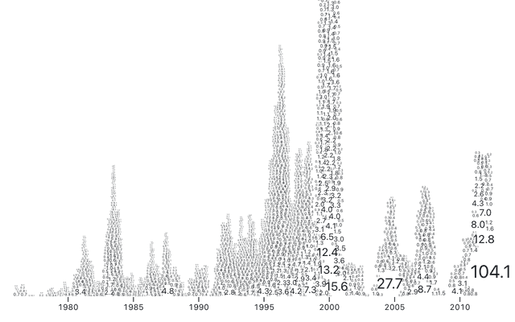</picture><q>Text dodge</q></a>
<a href="/plot/text-spiral"><picture><source srcset="../thumbnail/plot/text-spiral-dark.png" media="(prefers-color-scheme: dark)"></picture><q>Text spiral</q></a>
<a href="/plot/this-is-just-to-say"><picture><source srcset="../thumbnail/plot/this-is-just-to-say-dark.png" media="(prefers-color-scheme: dark)"></picture><q>This is just to say</q></a>
<a href="/plot/tip-format"><picture><source srcset="../thumbnail/plot/tip-format-dark.png" media="(prefers-color-scheme: dark)"></picture><q>Tip format</q></a>
<a href="/plot/tips-additional-channels"><picture><source srcset="../thumbnail/plot/tips-additional-channels-dark.png" media="(prefers-color-scheme: dark)"></picture><q>Interactive tips with additional channels</q></a>
<a href="/plot/tips-longer-text"><picture><source srcset="../thumbnail/plot/tips-longer-text-dark.png" media="(prefers-color-scheme: dark)"></picture><q>Interactive tips with longer text</q></a>
<a href="/plot/tips-paired-channels"><picture><source srcset="../thumbnail/plot/tips-paired-channels-dark.png" media="(prefers-color-scheme: dark)"></picture><q>Tips, paired channels</q></a>
<a href="/plot/two-dimensional-faceting"><picture><source srcset="../thumbnail/plot/two-dimensional-faceting-dark.png" media="(prefers-color-scheme: dark)"></picture><q>Two-dimensional faceting</q></a>
<a href="/plot/variable-fill-area"><picture><source srcset="../thumbnail/plot/variable-fill-area-dark.png" media="(prefers-color-scheme: dark)"></picture><q>Variable fill area</q></a>
<a href="/plot/vertical-bars-rotated-labels"><picture><source srcset="../thumbnail/plot/vertical-bars-rotated-labels-dark.png" media="(prefers-color-scheme: dark)"></picture><q>Vertical bars, rotated labels</q></a>
<a href="/plot/voronoi-labels"><picture><source srcset="../thumbnail/plot/voronoi-labels-dark.png" media="(prefers-color-scheme: dark)"></picture><q>Voronoi labels</q></a>
<a href="/plot/voronoi-scatterplot"><picture><source srcset="../thumbnail/plot/voronoi-scatterplot-dark.png" media="(prefers-color-scheme: dark)"></picture><q>Voronoi scatterplot</q></a>
<a href="/plot/warming-stripes"><picture><source srcset="../thumbnail/plot/warming-stripes-dark.png" media="(prefers-color-scheme: dark)"></picture><q>Warming stripes</q></a>
<a href="/plot/wealth-health-nations"><picture><source srcset="../thumbnail/plot/wealth-health-nations-dark.png" media="(prefers-color-scheme: dark)"></picture><q>The Wealth & Health of Nations</q></a>
<a href="/plot/wiggle-streamgraph"><picture><source srcset="../thumbnail/plot/wiggle-streamgraph-dark.png" media="(prefers-color-scheme: dark)"></picture><q>Wiggle streamgraph</q></a>
<a href="/plot/window-and-map"><picture><source srcset="../thumbnail/plot/window-and-map-dark.png" media="(prefers-color-scheme: dark)"></picture><q>Difference stroke</q></a>
<a href="/plot/wrap-tick-labels"><picture><source srcset="../thumbnail/plot/wrap-tick-labels-dark.png" media="(prefers-color-scheme: dark)"></picture><q>Axis with wrapped labels</q></a>
<a href="/stash/coolprop"><picture><source srcset="../thumbnail/stash/coolprop-dark.png" media="(prefers-color-scheme: dark)"></picture><q>Hello, coolprop</q></a>
<a href="/support/a-frame"><picture><source srcset="../thumbnail/support/a-frame-dark.png" media="(prefers-color-scheme: dark)">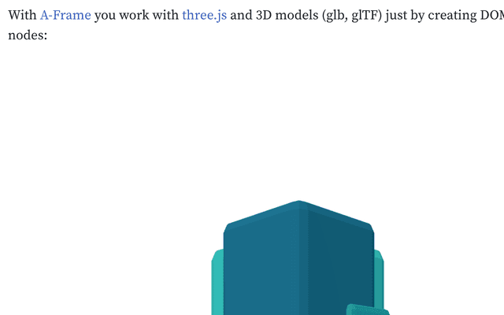</picture><q>A-frame</q></a>
<a href="/varia/covid-sumeau"><picture><source srcset="../thumbnail/varia/covid-sumeau-dark.png" media="(prefers-color-scheme: dark)"></picture><q>Sum’eau (Covid tracker)</q></a>
<a href="/varia/sequence-logos"><picture><source srcset="../thumbnail/varia/sequence-logos-dark.png" media="(prefers-color-scheme: dark)"></picture><q>Sequence Logos</q></a>
<a href="/video/ed3RfgPPZ2w"><picture><source srcset="../thumbnail/video/ed3RfgPPZ2w-dark.png" media="(prefers-color-scheme: dark)"></picture><q>Video: Deploy Framework projects to Observable</q></a>

